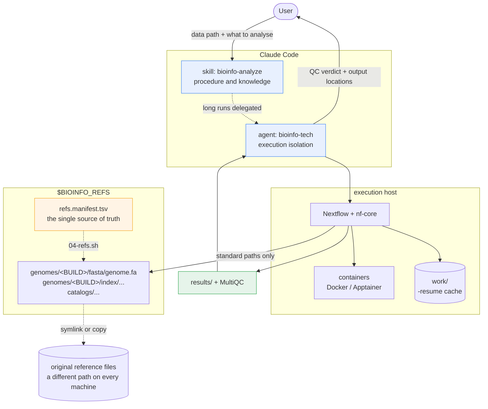

<p align="center">
  
</p>

<p align="center">
  
  
  
  
  <br>
  
  
  
</p>

<p align="center">
  <a href="README.md">한국어</a> ·
  <b>English</b>
</p>

<p align="center">
  <a href="#quick-start">Quick start</a> ·
  <a href="#a-real-session">A real session</a> ·
  <a href="#manual-setup">Manual setup</a> ·
  <a href="#usage">Usage</a> ·
  <a href="#architecture">Architecture</a> ·
  <a href="#supported-pipelines">Pipelines</a> ·
  <a href="#worked-example-sarek-germline-calling">sarek example</a>
</p>

---

**A Claude Code skill and agent that runs the bioinformatics analysis you asked for out loud, as an
nf-core Nextflow pipeline.**

Tell it where the data is and what you want to know. It picks a pipeline, writes the samplesheet,
and hands you a run plan with time and disk estimated first. Once you approve, it runs the thing,
watches it, and reads MultiQC to give you a QC verdict.

**It runs on a personal workstation, and on a shared server or an HPC cluster too.** The only things
that change are the container engine and the executor setting.

**What it will not do**: interpret biology. `the expression percentage of NF1 gene isoform NF1-201
is 17%` is where this agent's job ends; what that means for your research is yours.

<p align="center">
  
</p>

---

## Quick start

### Try the skill first — no clone needed

```bash
claude plugin marketplace add ehojune/bioinfo-agent
claude plugin install bioinfo@bioinfo
```

That is all. Tell it where the data is and what analysis you want, and pipeline choice, samplesheet,
estimates and a run plan come straight out.

If you do not have the `claude` CLI yet:

```bash
curl -fsSL https://claude.ai/install.sh | bash
```

### To actually run pipelines

You need Nextflow, a container engine, and references. **Do not set that up by hand — have Claude
Code do it.**

```
https://github.com/ehojune/bioinfo-agent
Clone this and set it up so I can use it in my environment.
```

Claude then follows [docs/agent-setup.md](docs/agent-setup.md). It works out which kind of host you
are on (personal PC / shared server / cluster) first, then runs only the scripts that apply. It also
reports what is ready and what is missing. **You do not have to run shell scripts one at a time in
the right order.**

If you would rather do it yourself, go to [Manual setup](#manual-setup).

> Either way, **you need disk.** Put 500 GB or more of working space on a big disk, not on `$HOME`.
> The human genome references alone are in the 30 GB range, and pipeline intermediates balloon to
> several times the size of the final results.

---

## A real session

<p align="center">
  
</p>

This is a session that actually happened, on a Y-STR project. Only the line breaks were tidied up.

It ran in Korean — the agent answers in whatever language you write in — so here is what is on
screen, top to bottom:

1. The plugin is installed. The entire request is one sentence: *"run a WGRS analysis on the
   SRR26793256 fastq in /mnt/d/Research/y_str_202605, answer in Korean."*
2. It lists the directory, loads the skill, then reads six files and runs six shell commands to find
   out what is actually there.
3. It notices a `sorted.bam` that someone had aligned by hand earlier, runs `samtools` in a
   container to read **only** the header, and compares that against what sarek would use.
4. **핵심 판단 — the call it made:** that BAM is already aligned to the same GRCh38gatk reference,
   consists of a single read group, and has not been deduplicated yet. Reusing the alignment skips
   re-aligning from FASTQ, which is tens to hundreds of hours.
5. Then it stops and asks how far to take the outputs, offering two scopes with the trade-off
   spelled out.

The part worth noticing is that **nobody asked it to check the BAM header.** It went from
`run a WGRS analysis on this fastq` to reading the header, comparing reference builds, and proposing
re-entry at `--step markduplicates` instead of a 90–270 hour re-alignment. And then it stopped,
because how far to take the outputs is a human's decision.

---

## Nextflow and nf-core

**[Nextflow](https://www.nextflow.io/)** ([GitHub](https://github.com/nextflow-io/nextflow) ·
[docs](https://docs.seqera.io/nextflow/)) — a workflow engine for bioinformatics. Write your
analysis steps as processes and it works out the dependencies and runs them in parallel, executes
each step inside a container, and caches intermediate results. Which buys you:

- **Reproducibility** — tool versions are pinned in containers, so you get the same result in six
  months and on somebody else's machine
- **Resumability** — when a twelve-hour run dies at hour eleven, `-resume` picks up where it died
- **Portability** — the same code runs on a laptop, a server, a SLURM cluster, or the cloud

**[nf-core](https://nf-co.re/)** ([GitHub](https://github.com/nf-core) ·
[pipeline list](https://nf-co.re/pipelines)) — the community standard for Nextflow pipelines. Over
150 pipelines covering the common analyses — RNA-seq, variant calling, methylation — all built to
the same conventions (a CSV samplesheet, `-profile`, `--outdir`, a MultiQC report). Rather than
writing a workflow from scratch, take a proven nf-core one as it is. That is this agent's default
position.

```bash
nextflow run nf-core/rnaseq -r 3.26.0 -profile docker --input samplesheet.csv --outdir results
```

That one line handles QC → trimming → alignment → quantification → report.
**This agent assembles that line for you, runs it, and reads the results.**

---

## Manual setup

Skip this section if the quick start was enough. This is for people who want to set it up by hand.

### First — where will it run?

Three cases, and only two things decide which: **do you have root**, and **is there a scheduler**.

| | A. Personal workstation | B. Shared server (no root) | C. HPC cluster |
|---|---|---|---|
| Container | Docker engine | **Apptainer / Singularity** | Apptainer |
| Executor | `local` | `local`, with much lower caps | **`slurm` / `pbs` / `lsf`** |
| Resource caps | cores−2, RAM−12 GB | only your allotted share | matched to the partition limits |
| bootstrap | all of 00–06 | only 03·04·05·06 | only 03·04·05·06 |
| References | prepare them yourself | **usually already there — ask first** | usually already there |

**B and C have their own guide in [docs/other-hosts.md](docs/other-hosts.md)** — how to move cache
directories out of `$HOME`, switching to Apptainer, scheduler settings, and etiquette on a busy
server.

> **If you are on C**, this is the combination it fits best. Nextflow was built for clusters in the
> first place, and one line of `executor = 'slurm'` submits a job per task. Running `local` on a
> head node is forbidden on most servers, so check before you start.

### Requirements

- Linux, or WSL2 (Windows)
- Docker **or** Apptainer/Singularity — either one is fine
- Java 17+
- 500 GB or more of working space recommended (on a big disk, not `$HOME`)

### 1. Build the substrate

```bash
git clone https://github.com/ehojune/bioinfo-agent.git ~/bioinfo-agent
cd ~/bioinfo-agent
```

| # | Script | What it does | A | B·C |
|---|---|---|:-:|:-:|
| 00 | `00-windows-wsl.ps1` | (Windows only) installs the WSL2 distro | ● | — |
| 01 | `01-wsl-base.sh` | user, Java 17, base packages | ● | ask your admin |
| 02 | `02-docker.sh` | Docker engine (not Desktop) | ● | — use Apptainer |
| 03 | `03-nextflow.sh` | Nextflow, nf-core tooling, the `NXF_*` environment | ● | ● (no root needed) |
| 06 | `06-tls-trust.sh` | detects corporate TLS inspection — exits immediately if there is none | ● | ● |
| 04 | `04-refs.sh` | builds the reference store from the manifest | ● | ● |
| 05 | `05-verify.sh` | checks every layer. Until it says `READY`, the install is not done | ● | ● |

All of them are idempotent, so re-running is safe. On B and C, `05-verify.sh` reports the Docker
item as a failure — that is normal on a host headed for Apptainer.

**Set four environment variables** to that machine's values (see `config/host.env.example`).

```bash
export BIOINFO_HOME=~/bioinfo-agent
export BIOINFO_REFS=/data/refs      # big disk
export BIOINFO_WORK=/scratch/nxf    # fast disk. Put this on $HOME and a quota will kill it
export BIOINFO_USER=$USER
```

> **WSL users, read this** — you must configure `.wslconfig`. Without it WSL2 takes only 50% of host
> RAM, while building a human STAR index wants ~40 GB. It dies of OOM with no warning and leaves you
> nothing but `exit 137`. See `config/wslconfig.example`. It cannot handle trailing inline comments,
> so put comments on their own lines.

### 2. Register the skill and agent

Claude Code skills and agents are **local files**. They do not follow your Anthropic account. Signing
in on a new computer does not bring them; they do not exist there until you run the below.

```bash
claude plugin marketplace add ehojune/bioinfo-agent
claude plugin install bioinfo@bioinfo
```

To confirm:

```bash
claude plugin details bioinfo@bioinfo
```

If you do not have the `claude` CLI:

```bash
curl -fsSL https://claude.ai/install.sh | bash
```

<details>
<summary>Symlinks instead of the plugin (for when you are editing the repo itself)</summary>

```bash
mkdir -p ~/.claude/skills ~/.claude/agents
ln -sfn ~/bioinfo-agent/skills/bioinfo-analyze ~/.claude/skills/bioinfo-analyze
ln -sfn ~/bioinfo-agent/agents/bioinfo-tech.md ~/.claude/agents/bioinfo-tech.md
```

Windows needs administrator rights for symlinks, so `install.ps1` uses junctions instead.

**Do not combine the plugin with symlinks.** The same skill ends up registered twice.

</details>

---

## Usage

### Just say it

The skill fires on its own triggers. There is no command to type.

```
I have 8 FASTQ files in ~/data/rnaseq. Mouse liver tissue, 4 control and 4 treated.
I want to see the expression differences.
```

### Hand long runs to the agent

```
Tell the bioinfo-tech agent to run sarek
```

`nextflow run` emits tens of thousands of log lines. Run inside a subagent, that traffic is digested
there and only the conclusion comes back. Run it in the main conversation and those logs evict
everything else.

### What to give it

| Item | Example |
|---|---|
| Absolute data path | `~/data/wgs/` |
| Sample count and format | 12 samples, paired-end, `fastq.gz`, PE150 |
| Species and genome build | human GRCh38 |
| **The actual question** | "find rare variants" vs "expression differences" — this is what decides the pipeline |
| Design | groups, replicates, batches, tumour/normal pairs |
| Time tolerance | overnight is fine / must not exceed 24 hours |
| Existing outputs | earlier BAMs, indexes you already built, the work directory of an interrupted run |

A path alone is enough to start. It counts the files itself, reads FASTQ headers to infer the rest,
and asks you to confirm. **If the request is ambiguous it asks and stops** — "run a WGRS analysis"
does not say whether you mean germline variants, repeat expansions, or coverage, and those are
different pipelines.

---

## Architecture



### Why it investigates the environment and inputs on its own

In practice it starts by checking things you did not ask it to check. That is the **agent loop**.

**A skill** is a markdown file. Not executing code — instructions that get loaded into the model's
context when a trigger matches. It states what to do in what order, and what not to do.

**An agent** is a separate instance with its own context window and its own tool permissions
(`Bash`, `Read`, `Grep`…). It does not answer once and stop; it repeats **observe → decide → act**
until it reaches the goal. When a pipeline dies, reading the log, working out the cause, fixing the
parameter and `-resume`-ing all happen without a human touching it.

Investigation comes first because the skill says it must.

| What it checks | Why | Where it is written |
|---|---|---|
| Execution environment | Is Docker up, is there 1.5× the estimated disk, do the reference paths resolve | `05-verify.sh`, step 4 preflight |
| Input files | Sample count, pairing, compression, read length — **the files themselves, not your description** | step 1 intake |

**Verifying instead of believing the description is the design intent.** You are told "12 samples,
paired-end" and there are actually nine, or one pair is missing its R2 — that happens often, and you
need to know now rather than twelve hours from now.

There is a line on the investigating, though. **Steps 1–3 are read-only**: `ls`, `du`, a few FASTQ
header lines, and no more. Running analysis tools comes after the run plan is approved. If you get an
approval prompt during intake, that is a bug.

### Why three layers

| Layer | Lives in | Why it is separate |
|---|---|---|
| **Substrate** | `bootstrap/`, `config/` | Machine-specific and constantly changing. Re-running rebuilds it from scratch |
| **Skill** | `skills/bioinfo-analyze/` | It is just markdown. You edit it, diff it, and read it yourself. Knowledge trapped in an agent prompt is knowledge you cannot grep |
| **Agent** | `agents/` | Execution isolation. Logs stay in the subagent and only the conclusion crosses over |

When a pipeline dies you diagnose it from the skill's failure-mode reference, and whatever you worked
out gets written back into the skill. **The agent is disposable; the skill compounds.**

### The reference store

No original filename (`hg38.fa` and friends) should ever appear in a pipeline command. Always the
standard path:

```
$BIOINFO_REFS/genomes/GRCh38/fasta/genome.fa
```

`config/refs.manifest.tsv` connects standard paths to real files. Four modes:

| Mode | What it does | When |
|---|---|---|
| `link` | symlink | sequential reads (FASTA, GTF, BED) |
| `copy` | a real copy | indexes with heavy random access, when they sit on slow storage |
| `build` | a tool generates it | STAR/salmon indexes, `.dict` |
| `fetch` | needs downloading | the GATK bundle, VEP caches |

**Moving to another machine, the only thing you fix is the source column.** Standard paths are the
contract, so they stay put.

### The seven steps

| # | Step | Output |
|---|---|---|
| 1 | Intake | Looks at the files. Does not believe the description |
| 2 | Pipeline choice | Pipeline plus a pinned revision, and why that one |
| 3 | **Run plan + approval** | Estimated time and disk, missing references, any scope it narrowed |
| 4 | Preflight + stub | Confirms 1.5× the disk, validates the samplesheet, `-stub-run` |
| 5 | Run | Background, log file, `-resume`-able |
| 6 | QC verdict | PASS / PASS WITH CAVEATS / FAIL per sample |
| 7 | Handoff | Output locations, decisions made, what is next |

**Steps 1–3 execute nothing.** Permitted: `ls`, `du`, `file`, a few FASTQ header lines. It will not
open a 50 GB BAM "just to check" — it records that the file exists and proposes verification as a
line item in the run plan.

### Guardrails

- Does not start work estimated over **24 hours** without approval
- Does not skip the **stub-run**
- **Never deletes a work directory** — that kills `-resume`
- Refuses when free disk is under **1.5×** the estimate
- Warns before any download over **10 GB**
- If it narrowed the scope, it says so out loud
- QC verdicts only. No biological interpretation
- **Does not hand-reproduce an existing pipeline** — wiring `bwa` + `samtools` + `gatk` together
  yourself is rewriting sarek, and it costs you reproducibility, `-resume` and MultiQC
- **Does not run binaries it found on disk** — tools come from containers

---

## Supported pipelines

Nine of them documented, down to samplesheet schemas, resource estimates, QC thresholds and failure
modes.

| Pipeline | For | Minimum input | Main output |
|---|---|---|---|
| **rnaseq** | bulk RNA-seq quantification | FASTQ + `strandedness` | `salmon.merged.gene_counts.tsv` |
| **differentialabundance** | differential expression (DESeq2) | count matrix + `contrasts.csv` | HTML report, DE tables |
| **fetchngs** | fetching public data | accessions (`SRR`, `PRJNA`, `GSE`) | FASTQ + a samplesheet for the next step |
| **sarek** | germline / somatic variants | FASTQ or BAM/CRAM | VCF, aligned CRAM |
| **methylseq** | methylation (WGBS/RRBS/EM-seq) | FASTQ | CpG methylation rates, conversion rate |
| **atacseq** | chromatin accessibility | FASTQ + `replicate` | consensus peaks, bigWig |
| **chipseq** | ChIP-seq | FASTQ + `antibody`, `control` | peaks, FRiP |
| **cutandrun** | CUT&RUN / CUT&Tag | FASTQ + `control` | peaks (SEACR/MACS2) |
| **scrnaseq** | single-cell RNA | FASTQ + `expected_cells` | count matrix, h5ad |

### Anything else

**If nf-core has it, it gets procured.** There are over 150, and it fetches one when you ask.

**Even when nf-core does not have it.** STR tools like ExpansionHunter, TRGT and HipSTR are the
case in point. It runs the tool directly, but pins the version in a container and records it in the
run log.

**Not covered**: long-read (ONT, PacBio) pipelines, and biological interpretation.

---

## Worked example: sarek germline calling

Against the revision 3.9.0 schema.

### The conversation

```
I have 6 WGS FASTQ samples in /data/wgs. Human 30x, germline, no tumour.
I want to find candidate variants for a rare disease.
```

It counts the files itself, points out which references are missing, then works out time and disk and
hands you a run plan. **Six samples of 30x WGS is over a week of work on a workstation**, so it says
that first and offers alternatives.

### The samplesheet

Only `patient` and `sample` are **required**.

```csv
patient,sample,sex,status,lane,fastq_1,fastq_2
FAM01,FAM01-proband,XY,0,L001,/data/wgs/P1_L001_R1.fastq.gz,/data/wgs/P1_L001_R2.fastq.gz
FAM01,FAM01-proband,XY,0,L002,/data/wgs/P1_L002_R1.fastq.gz,/data/wgs/P1_L002_R2.fastq.gz
FAM01,FAM01-father,XY,0,L001,/data/wgs/F1_L001_R1.fastq.gz,/data/wgs/F1_L001_R2.fastq.gz
FAM01,FAM01-mother,XX,0,L001,/data/wgs/M1_L001_R1.fastq.gz,/data/wgs/M1_L001_R2.fastq.gz
```

| Column | Required | Meaning |
|---|---|---|
| `patient` | ✅ | The individual/family grouping. Tumour/normal pairs are matched within one value |
| `sample` | ✅ | Sample identifier |
| `sex` | | `XX` / `XY` / `NA` |
| `status` | | `0` normal, `1` tumour. Defaults to 0 |
| `lane` | | Required with multiple lanes. Read groups get split so duplicate marking is correct |
| `bam`/`bai`, `cram`/`crai` | | When starting from something already aligned |
| `vcf`, `variantcaller` | | When you only want annotation |

Several rows with the same `patient`+`sample` differing only in `lane` are merged automatically.

### References — three ways

**(A) Let nf-core handle it.** `--genome` defaults to `GATK.GRCh38` and `--igenomes_base` to
`s3://ngi-igenomes/igenomes`. Give it nothing and it pulls from AWS. That works, but it is tens of
gigabytes and you have no control over it. Downloads over 10 GB need approval, so the agent asks
first.

**(B) Name your local references.** Pass the standard paths.

```bash
REFS=$BIOINFO_REFS/genomes/GRCh38gatk
nextflow run nf-core/sarek -r 3.9.0 -profile docker \
  -c $BIOINFO_HOME/config/local.config \
  --input samplesheet.csv --outdir results \
  --fasta $REFS/fasta/genome.fa --fasta_fai $REFS/fasta/genome.fa.fai \
  --dict  $REFS/fasta/genome.dict --bwa $REFS/index/bwa \
  --dbsnp $REFS/gatkbundle/dbsnp.vcf.gz \
  --known_indels $REFS/gatkbundle/known_indels.vcf.gz \
  --tools haplotypecaller --joint_germline
```

**(C) Just tell it in conversation — recommended.**

```
dbsnp is at /data/refs/dbsnp_146.hg38.vcf.gz
```

It adds a row to the manifest, wires it to the standard path with `04-refs.sh`, and uses only the
standard path from then on. **Do not hand-place files into `/refs`** — anything not in the manifest
disappears on the next machine.

### Reusing outputs you already have

| What you have | The right response |
|---|---|
| BQSR-finished BAM/CRAM | `--step variant_calling`, with `bam`/`bai` in the samplesheet |
| Duplicate-marked BAM | `--step prepare_recalibration` |
| Trimmed FASTQ | Feed as `fastq_1`/`fastq_2` and skip trimming with a flag |
| VCF only | `--step annotate` |

All of these **go through the pipeline's own restart mechanism.** It is not a human picking up where
they left off.

### Key parameters

```
--step     mapping | markduplicates | prepare_recalibration | recalibrate
           | variant_calling | annotate              (default: mapping)

--tools    haplotypecaller  deepvariant  strelka  freebayes  mutect2  ...   variant calling
           manta  tiddit  cnvkit  ascat  controlfreec                       SV / CNV
           vep  snpeff  snpsift                                             annotation

--wes                 for exome/panel
--intervals <bed>     capture regions. Omit on WES and it sweeps the whole genome, several times slower
--joint_germline      joint calling (family analysis)
--save_reference      save the indexes it built → reused on the next run
```

### How long it takes

On a single node of roughly 20 cores. Spread the samples across a cluster and **total time divides by
the sample count.**

| Job | Per sample |
|---|---|
| WES 100x, haplotypecaller | 4–8 hours |
| **WGS 30x, haplotypecaller** | **over a day** |
| WGS 30x plus SV/CNV | 1.5–2× |

**A WGS cohort on a single node is not realistic.** Six samples takes over a week. The agent says so
before starting and offers alternatives — fewer samples, switch to WES, cut `--tools`, or **move to a
cluster**. With `executor = 'slurm'`, those same six samples are a bit over a day.

> The table above is for sarek **3.9.0**. nf-core changes columns and parameters between revisions,
> so the agent checks the schema of the revision it is actually about to run before writing the
> samplesheet.

---

## Repo layout

```
bioinfo-agent/
├── bootstrap/          numbered idempotent setup scripts, 00 → 06
├── config/
│   ├── local.config        executor, resource caps, container engine
│   ├── genomes.config      genome build → standard path mapping
│   ├── refs.manifest.tsv   the single source of truth for the reference store
│   ├── host.env.example    the variables to fix when moving machines
│   └── wslconfig.example   WSL2 resource caps
├── skills/bioinfo-analyze/
│   ├── SKILL.md            entry point — procedure and guardrails
│   └── references/         pipeline choice, samplesheets, runbooks, QC thresholds,
│                           estimation, reference standards, procuring new ones
├── agents/bioinfo-tech.md  agent definition
├── bin/preflight.sh        read-only pre-run checks (disk, docker, references)
├── scripts/
│   └── check-samplesheet.sh  samplesheet validation — paths, pairing, CRLF, duplicate IDs
├── docs/
│   ├── agent-setup.md      **for AI** — the procedure for doing the install given just the repo URL
│   ├── other-hosts.md      native Linux / shared server / cluster
│   └── logo.svg
└── install.ps1             junction-based install for Windows
```

`$BIOINFO_REFS` is not in the repo. It is hundreds of gigabytes and gets reconstructed from the
manifest. **What is portable is the manifest, not the bytes.**

---

## When something breaks

```bash
bash bootstrap/05-verify.sh
```

It sweeps every layer and prints a verdict per item. Common causes:

| Symptom | Usually this |
|---|---|
| File not found on a genome path | A manifest row is `MISSING`, or its source moved. Re-run `04-refs.sh` |
| Inexplicably 5–10× slow | (WSL) something hot is on `/mnt/*`. Move it to ext4 |
| `Cannot connect to the Docker daemon` | (WSL) not restarted after editing `wsl.conf`. `wsl --terminate` |
| `docker: permission denied` | docker group changes only apply from a fresh login shell |
| `curl: (60) SSL certificate problem` | Corporate TLS inspection. `06-tls-trust.sh` |
| `exit 137` (especially on STAR indexes) | Memory cap. On WSL, start with `.wslconfig` |
| Died partway | `-resume`. **Never delete the work directory** |
| The skill is registered twice | You used the plugin and symlinks together |

### Corporate TLS inspection

Some institutional networks terminate TLS and re-sign with a private CA. They intercept
**selectively**, so "some downloads work" does not mean you are fine. And **there are three trust
stores** — the system one (curl, apt), Java's (Nextflow is a JVM and does not look at the system
store), and Python's (nf-core). Fix only the system one and you end up with working curl and
un-fetchable pipelines.

```bash
bash bootstrap/06-tls-trust.sh            # detect only
sudo bash bootstrap/06-tls-trust.sh --accept   # install the CA it found into all three stores
```

It only reports by default. Add `--accept` only once you have confirmed the printed issuer really is
your organisation's kit. Turning verification off with `curl -k` is not a fix.

---

## License

MIT
