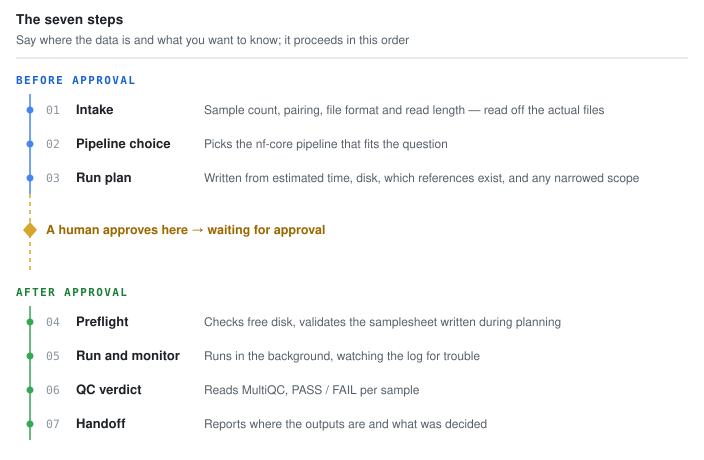

<p align="center">
  
</p>

<p align="center">
  
  
  
  
  <br>
  
  
  
</p>

<p align="center">
  <a href="README.md">한국어</a> ·
  <b>English</b>
</p>

<p align="center">
  <a href="#quick-start">Quick start</a> ·
  <a href="#a-real-session">A real session</a> ·
  <a href="#manual-setup">Manual setup</a> ·
  <a href="#usage">Usage</a> ·
  <a href="#design">Design</a> ·
  <a href="#supported-pipelines">Pipelines</a>
</p>

---

**A Claude Code skill and agent that runs the bioinformatics analysis you asked for out loud, as an
nf-core Nextflow pipeline.**

Tell it where the data is and what you want to know. It picks a pipeline, writes the samplesheet,
and hands you a run plan with time and disk estimated first. Once you approve, it runs the thing,
watches it, and reads MultiQC to give you a QC verdict. **It runs on a personal workstation, and on
a shared server or an HPC cluster too** — the only things that change are the container engine and
the executor setting.

**What it will not do**: interpret biology. `the expression percentage of NF1 gene isoform NF1-201
is 17%` is where this agent's job ends; what that means for your research is yours.

<p align="center">
  
</p>

---

## Quick start

### Try the skill first — no clone needed

```bash
claude plugin marketplace add ehojune/bioinfo-agent
claude plugin install bioinfo@bioinfo
```

That is all. Tell it where the data is and what analysis you want, and pipeline choice, samplesheet,
estimates and a run plan come straight out. No `claude` CLI yet?
`curl -fsSL https://claude.ai/install.sh | bash`.

> **Pick one install route.** The `claude plugin` commands above and the Windows `install.ps1` are
> two ways of doing the same thing. Use both and the skill and agent get registered twice.

### To actually run pipelines

You need Nextflow, a container engine, and references. **Do not set that up by hand — have Claude
Code do it.**

```
https://github.com/ehojune/bioinfo-agent
Clone this and set it up so I can use it in my environment.
```

Claude then follows [docs/agent-setup.md](docs/agent-setup.md): it works out which kind of host you
are on (personal PC / shared server / cluster), runs only the scripts that apply, and reports what
is ready and what is missing. To do it yourself, see [Manual setup](#manual-setup).

> Either way, **you need disk.** Put 500 GB or more of working space on a big disk, not on `$HOME`.
> The human genome references alone are in the 30 GB range, and pipeline intermediates balloon to
> several times the size of the final results.

---

## A real session

<p align="center">
  
</p>

A Y-STR project, in Korean — the agent answers in whatever language you write in. Worth noticing:
**nobody asked it to check the BAM header.** It went from `run a WGRS analysis on this fastq` to
spotting a `sorted.bam` someone had aligned by hand, comparing reference builds, and proposing
re-entry at `--step markduplicates` instead of a 90–270 hour re-alignment. **Then it stopped and
asked** how far to take the outputs.

---

## Nextflow and nf-core

**[Nextflow](https://www.nextflow.io/)** ([docs](https://docs.seqera.io/nextflow/)) runs each step
in a container and caches results, which buys reproducibility, `-resume`, and portability.
**[nf-core](https://nf-co.re/)** ([list](https://nf-co.re/pipelines)) is 150+ pipelines built to the
same conventions on top of it.

```bash
nextflow run nf-core/rnaseq -r 3.18.0 -profile docker --input samplesheet.csv --outdir results
```

That one line handles QC → trimming → alignment → quantification → report. **This agent assembles
it, runs it, and reads the results.** Pipeline versions are set by
[`config/pipelines.tsv`](config/pipelines.tsv) and checked before a run starts. Any revision printed
in the docs, the one above included, is a copy of that table.

---

## Manual setup

Skip this if the quick start was enough. Requirements: Linux or WSL2, Docker **or**
Apptainer/Singularity, Java 17+, and 500 GB or more of working space on a big disk rather than
`$HOME`.

What follows is case A, a personal workstation with root. **A shared server without root, or an HPC
cluster, has its own guide in [docs/other-hosts.md](docs/other-hosts.md)** — Apptainer instead of
Docker, caches out of `$HOME`, scheduler settings, lowered caps. Running `local` on a cluster head
node is forbidden at most sites, so check before you start.

### 1. Build the substrate

```bash
git clone https://github.com/ehojune/bioinfo-agent.git ~/bioinfo-agent
cd ~/bioinfo-agent
cp config/host.env.example config/host.env   # set the distro name, paths and caps for this machine
set -a; . config/host.env; set +a

bash bootstrap/01-wsl-base.sh    # 00-windows-wsl.ps1 first, on Windows
bash bootstrap/02-docker.sh
bash bootstrap/03-nextflow.sh    # writes ~/.config/bioinfo/env.sh
bash bootstrap/06-tls-trust.sh   # before 04: fetching references needs working TLS
bash bootstrap/04-refs.sh
bash bootstrap/05-verify.sh      # until this prints READY, the install is not done
```

All of them are idempotent, so re-running is safe. What each script does, and which to skip on which
host, is in [docs/agent-setup.md](docs/agent-setup.md).

> **WSL users, read this** — you must configure `.wslconfig` (see `config/wslconfig.example`).
> Without it WSL2 takes only 50% of host RAM, while a human STAR index wants ~38 GB: it dies of OOM
> with no warning and leaves you nothing but `exit 137`. Trailing inline comments are not parsed, so
> put comments on their own lines.

### What the bootstrap grants itself

`01-wsl-base.sh` gives the pipeline user **passwordless sudo** inside the distro
(`/etc/sudoers.d/90-bioinfo-nopasswd`). `02-docker.sh` adds that user to the **docker group**, which
is root-equivalent because the daemon runs as root. Both exist so the install runs unattended and so
pipelines can start containers, and both apply only inside the WSL distro dedicated to pipelines. On
a machine other people use, skip 01 and 02 and let the administrator do it.

### 2. Register the skill and agent

Claude Code skills and agents are **local files**; they do not follow your Anthropic account. The
two `claude plugin` commands from the [quick start](#quick-start) are the whole install — confirm
with `claude plugin details bioinfo@bioinfo`. If you will be editing the repo, symlink into
`~/.claude/skills` and `~/.claude/agents` instead (`install.ps1` uses junctions on Windows, where
symlinks need admin rights). **Do not combine the two.**

---

## Usage

The skill fires on its own triggers. There is no command to type.

```
I have 8 FASTQ files in ~/data/rnaseq. Mouse liver tissue, 4 control and 4 treated.
I want to see the expression differences.
```

Hand long runs to the agent — `Tell the bioinfo-tech agent to run sarek`. `nextflow run` emits tens
of thousands of log lines; run inside a subagent, that traffic is digested there and only the
conclusion comes back.

> **A long run must always launch under `tmux` — leaving the window open is not enough on its
> own.** WSL shuts the distro down when the last session closes, so a job pushed into the
> background (`nohup … &`) disappears without writing a single log line; separately, an agent that
> backgrounds Nextflow inside its own turn and waits for it has been measured losing the run the
> moment its turn ends, even with the session still open. Only `tmux`'s own server process survives
> both. Details in [runbook.md](skills/bioinfo-analyze/references/runbook.md) section 5.

Useful to give it: the absolute data path, sample count and format, species and genome build, **the
actual question** ("find rare variants" vs "expression differences" is what decides the pipeline),
the design, your time tolerance, and any existing outputs. A path alone is enough to start — it
counts the files itself and infers the rest. **If the request is ambiguous it asks and stops.**

---

## Design

### Why it investigates before being asked

To control the variables in a real analysis environment, mostly human error. It checks the
**execution environment** (is Docker up, is there 1.5× the estimated disk, do the reference paths
resolve) and the **input files** (count, pairing, compression, read length) against reality rather
than against your description — you are told "12 samples, paired-end" and there are actually nine
often enough that you need to know now, not twelve hours from now.

That work is an **agent loop**: a separate instance with its own context window and tool
permissions, repeating observe → decide → act. But **steps 1–3 are read-only** — `ls`, `du`,
`file`, a few FASTQ header lines. A 50 GB BAM is recorded, not opened; verifying it becomes a line
in `plan.md`.

Why the three layers (substrate, skill, agent) are split, how references travel as a manifest, and
the full guardrail list are in **[docs/agent-architecture.md](docs/agent-architecture.md)**. None of
it is needed on first use, and nothing is lost by reading it later.

---

## Supported pipelines

Nine documented. Pinned revisions live in [`config/pipelines.tsv`](config/pipelines.tsv),
samplesheet columns in [samplesheets.md](skills/bioinfo-analyze/references/samplesheets.md), and
estimates, QC thresholds and failure modes in
[`skills/bioinfo-analyze/references/`](skills/bioinfo-analyze/references/).

| Pipeline | For | Main output |
|---|---|---|
| **rnaseq** | bulk RNA-seq quantification | `salmon.merged.gene_counts.tsv` |
| **differentialabundance** | differential expression (DESeq2) | HTML report, DE tables |
| **fetchngs** | public data (`SRR`, `PRJNA`, `GSE`) | FASTQ + a samplesheet for the next step |
| **sarek** | germline / somatic variants | VCF, aligned CRAM |
| **methylseq** | methylation (WGBS/RRBS/EM-seq) | CpG methylation rates, conversion rate |
| **atacseq** | chromatin accessibility | consensus peaks, bigWig |
| **chipseq** | ChIP-seq | peaks, FRiP |
| **cutandrun** | CUT&RUN / CUT&Tag | peaks (SEACR/MACS2) |
| **scrnaseq** | single-cell RNA | count matrix, h5ad |

Anything else in nf-core gets procured on request. Tools nf-core does not have — ExpansionHunter,
TRGT, HipSTR — get run directly, version pinned in a container and recorded in the run log. **Not
covered**: long-read (ONT, PacBio) pipelines, and biological interpretation.

---

## When something breaks

```bash
bash bootstrap/05-verify.sh
```

It sweeps every layer and prints a verdict per item. Run-time failures are covered in
[runbook.md](skills/bioinfo-analyze/references/runbook.md), install-time ones — including corporate
TLS interception, which needs all three trust stores fixed and not just the system one — in
[docs/agent-setup.md](docs/agent-setup.md). Three that catch everyone: a run that died partway wants
`-resume` and **never** a deleted work directory, a skill registered twice means the plugin and
`install.ps1`/symlinks were both used, and a run that vanished without writing a single log line was
started with `nohup`.

---

## License

[MIT](LICENSE)
