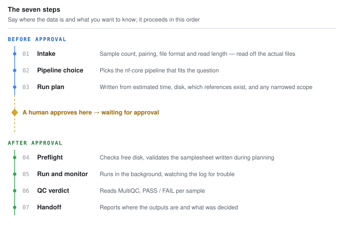
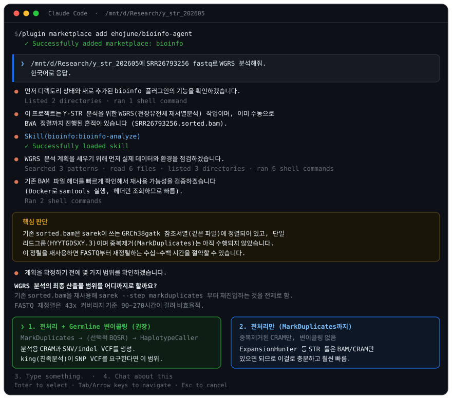

<p align="center">
  
</p>

<p align="center">
  
  
  
  
</p>

<p align="center"><a href="README.md">한국어</a> · <b>English</b></p>

**A Claude Code skill and agent that selects and runs Nextflow pipelines, then reports QC results from your data path and analysis request.**

It checks inputs and reusable outputs, estimates time and disk, and waits for approval of the plan.
After approval it runs preflight, launches the workflow, and hands off QC, outputs and run records.
Personal PCs, WSL2, shared servers and HPC use the container engine and executor appropriate to the host.
Biological interpretation belongs to the researcher.

<p align="center">
  
</p>

## Quick start

### Install the skill and agent

```bash
claude plugin marketplace add ehojune/bioinfo-agent
claude plugin install bioinfo@bioinfo
claude plugin details bioinfo@bioinfo
```

Pipeline selection and planning need no clone. Execution needs Nextflow, containers, references and workspace.

```bash
claude plugin update bioinfo@bioinfo
```

Installed plugins use a versioned cache. Update guidance and evidence are in the
[reference index](docs/reference/README.md).
**Choose one installation route: plugin, Windows `install.ps1`, or symlinks.**

### Prepare the execution environment

Ask Claude Code:

```text
https://github.com/ehojune/bioinfo-agent
Clone this repository and set it up to run pipelines on my host.
```

The [setup procedure](docs/agent-setup.md) checks the host, permissions and existing references
before selecting bootstrap steps. For manual setup, use Linux or WSL2, Java 17+, and Docker or
Apptainer/Singularity. Copy `config/host.env.example` to `config/host.env` and set actual paths and limits.

| Host | Container and execution | Setup guide |
|---|---|---|
| Personal PC or dedicated WSL | Docker, `local` | [Bootstrap order and users](docs/agent-setup.md) |
| Shared server without root | Apptainer/Singularity, restricted resources | [Other hosts](docs/other-hosts.md) |
| HPC | Apptainer/Singularity, site scheduler | [Other hosts](docs/other-hosts.md) |

The personal-PC order is 01 → 02 → 03 → **06 (TLS) → 04 (references)** → 05; Windows starts with 00.
Run 01/02 as root and the remaining steps as the pipeline user; 03 refuses root.
01 grants passwordless sudo and 02 adds root-equivalent Docker group access.
Administrators handle those steps on shared machines.

Put work and caches outside home quotas and check the plan's disk and memory estimates.
STAR needs a Linux filesystem such as ext4: WSL drvfs paths (`/mnt/c`, `/mnt/d`) cause execution failures.
A human STAR index needs about 38 GB RAM; see the [WSL configuration example](config/wslconfig.example).

```bash
bash bootstrap/05-verify.sh
```

Read the verdict and resolve requirements for your host. The setup procedure explains Docker check failures on Apptainer hosts.

## Usage

```text
I have mouse liver FASTQs in ~/data/rnaseq, four controls and four treated samples.
I want differential expression.
```

Give the data path, species/build, samples and design, purpose, time limit and existing outputs.
The agent checks file counts, formats and relevant headers, then looks for reusable outputs.
Checks before the plan are read-only; ambiguous scope is clarified first.

Delegate long runs with `Tell the bioinfo-tech agent to run sarek`.
**Use the runbook's tmux launch procedure for long runs.**
Background jobs have been lost when an agent turn or WSL session ended.

| Need | Source |
|---|---|
| Pipeline choice and prepared scope | [pipeline-selection.md](skills/bioinfo-analyze/references/pipeline-selection.md) |
| Input columns and pairing | [samplesheets.md](skills/bioinfo-analyze/references/samplesheets.md) |
| Time and disk estimates | [estimates.md](skills/bioinfo-analyze/references/estimates.md) |
| Launch, resume and failure handling | [runbook.md](skills/bioinfo-analyze/references/runbook.md) |
| QC verdicts | [qc-interpretation.md](skills/bioinfo-analyze/references/qc-interpretation.md) |

<p align="center">
  
</p>

## Supported pipelines

The current inventory is **19 nf-core pipelines and one in-repository PacBio pipeline**.
[config/pipelines.tsv](config/pipelines.tsv) defines nf-core revision pins checked at preflight.
The table summarizes the prepared scope here; it does not assert validation of every upstream feature.

| Pipeline | Prepared scope |
|---|---|
| rnaseq | Bulk RNA-seq alignment and quantification |
| differentialabundance | Differential expression and reports |
| fetchngs | Public accessions to FASTQs and downstream samplesheets |
| sarek | Germline and somatic variant analysis |
| methylseq | Methylation analysis |
| atacseq | Chromatin accessibility |
| chipseq | ChIP-seq peaks and QC |
| cutandrun | CUT&RUN and CUT&Tag |
| scrnaseq | Single-cell RNA count matrices |
| ampliseq | 16S/ITS amplicons, DADA2 and QIIME2 |
| mag | Shotgun metagenome assembly, binning and QC |
| taxprofiler | Kraken2 taxonomic profiling |
| nanoseq | QC and alignment of already-basecalled ONT DNA FASTQs |
| rnasplice | SUPPA2 per-isoform splicing analysis |
| raredisease | Variant calling and QC; full annotation and disease ranking outside prepared scope |
| bacass | Short-read bacterial assembly and Prokka annotation |
| viralrecon | Illumina SARS-CoV-2 amplicons, variants, consensus and lineage outputs |
| isoseq | PacBio subreads to Iso-Seq transcript models |
| spatialaxe | 10x Xenium bundles, coordinate-mode segmentation and QC |

**[pacbio-hifi-wgs](pipelines/pacbio-hifi-wgs/)** is a local Nextflow DSL2 pipeline.
It accepts subreads, HiFi BAM/FASTQ or aligned BAMs for germline SNV/indel, pbsv SV, phasing, haplotagging and QC.
Already-aligned tumor–normal BAM pairs use CPU DeepSomatic. `--run_label` separates reports in a shared outdir.

CLR input is accepted but cannot be converted to HiFi.
The small-variant callers have no suitable CLR model: those outputs are exploratory and each dataset gets a warning file.
See the pipeline README for input restrictions and accuracy evidence.

Further pipelines are assessed on request through the [procurement procedure](skills/bioinfo-analyze/references/new-pipeline.md).
The plan presents choices such as nf-core reuse, a direct tool or building an in-repository pipeline for approval.

## Execution evidence

The [example records](docs/examples/README.md) and [evidence index](docs/reference/README.md)
link actual runs and known limitations. Test-profile success, real-data completion and accuracy against truth sets are separate validation stages.

The PacBio [whole-genome record](docs/examples/20260926-pacbio-hifi-wgs-giab-wholegenome/handoff.md)
covers 19 GIAB small-variant runs, five HG002 SV runs and 13 HG008 somatic pairs.
Germline numbers were measured at `48ec463`; the same datasets were not rerun on current 0.2.0.
SV accuracy covers HG002 only, and somatic INDEL recall is low. Conditions and full results are in the record.

## When something breaks

For setup, use `bootstrap/05-verify.sh` and the [setup procedure](docs/agent-setup.md).
For a run:

```bash
NXFDIR=/path/to/run
bash "$BIOINFO_HOME/scripts/triage-run.sh" --tail 20 "$NXFDIR"
bash "$BIOINFO_HOME/scripts/triage-run.sh" --json "$NXFDIR"
```

The tool reads logs, traces, failed-task commands and stderr.
States are `running`, `failed`, `cancelled`, `succeeded` and `unknown`; a failed attempt alone does not determine the run's final state.

Resume with `-resume` and retain work directories and run records.
Personal `runs/` history is ignored by Git; shared examples live in `docs/examples/`.
The work-directory guard applies to Bash tool calls with the plugin installed.

See the [architecture guide](docs/agent-architecture.md) for layers, reference contracts and guardrails.

## License

[MIT](LICENSE)
