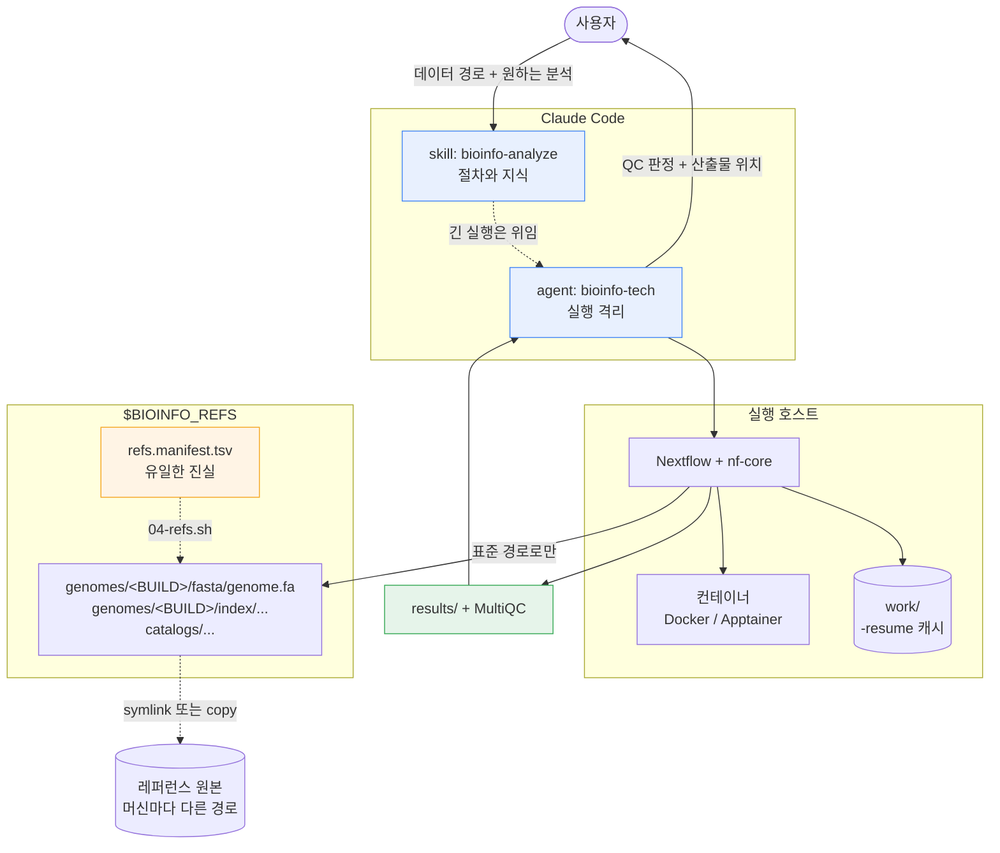

<p align="center">
  
</p>

<p align="center">
  
  
  
  
  <br>
  
  
  
</p>

<p align="center">
  <a href="#빠른-시작">빠른 시작</a> ·
  <a href="#직접-설치">직접 설치</a> ·
  <a href="#사용법">사용법</a> ·
  <a href="#아키텍처">아키텍처</a> ·
  <a href="#지원-파이프라인">파이프라인</a> ·
  <a href="#예시-sarek-germline-변이-검출">예시</a>
</p>

---

자동화된 bioinformatics 분석을 위해
nf-core Nextflow 파이프라인을 대신 돌려주는 Claude Code 스킬 + 에이전트.

데이터 경로와 원하는 분석을 말하면 파이프라인을 고르고, 샘플시트를 만들고, 소요 시간과 디스크를
추정해 계획서를 내고, 승인을 받은 뒤 실행·감시하고, MultiQC를 읽어 QC 판정을 돌려준다.

**개인 워크스테이션에서도, 공용 서버나 HPC 클러스터에서도 돈다.** 달라지는 건 컨테이너 엔진과
executor 설정뿐이다.

**하지 않는 것**: 생물학적 해석. `duplication 43%, 임계 30% 초과` 까지가 이 에이전트의 일이고,
그게 연구에 무슨 의미인지는 사람의 일이다.

---

## 빠른 시작

### 스킬만 먼저 써보기 — clone 불필요

```bash
claude plugin marketplace add ehojune/bioinfo-agent
claude plugin install bioinfo@bioinfo
```

끝이다. Claude Code에게 데이터 경로와 원하는 분석을 말하면 된다. 파이프라인 선정, 샘플시트 작성,
소요 추정, 계획서까지 바로 받을 수 있다.

`claude` CLI가 없으면 먼저:

```bash
curl -fsSL https://claude.ai/install.sh | bash
```

### 실제로 파이프라인을 돌리려면

Nextflow, 컨테이너 엔진, 레퍼런스가 필요하다. **직접 세팅하지 말고 Claude Code에게 시키면 된다.**

```
https://github.com/ehojune/bioinfo-agent
이거 clone 하고 내 환경에서 쓸 수 있게 설정해줘.
```

이러면 Claude가 [docs/agent-setup.md](docs/agent-setup.md)를 따라간다. 호스트 종류(개인 PC / 공용
서버 / 클러스터)를 먼저 판별하고, 필요한 스크립트만 골라 돌리고, 무엇이 준비됐고 무엇이 빠졌는지
보고한다. **셸 스크립트를 하나씩 순서 맞춰 돌릴 필요가 없다.**

직접 하고 싶으면 [직접 설치](#직접-설치)로.

> 어느 쪽이든 **디스크가 필요하다.** 작업 공간 500GB 이상을 `$HOME` 이 아닌 큰 디스크에 잡는다.
> 사람 게놈 레퍼런스만 30GB대, 파이프라인 중간 산출물은 최종 결과의 몇 배로 부푼다.

---

## Nextflow와 nf-core

**Nextflow** — 생명정보 분석용 워크플로 엔진. 분석 단계를 프로세스로 쓰면 의존성을 따져 병렬로
돌리고, 각 단계를 컨테이너 안에서 실행하며, 중간 결과를 캐시한다. 그래서:

- **재현된다** — 도구 버전이 컨테이너에 고정되므로 6개월 뒤에도, 남의 컴퓨터에서도 같은 결과
- **재개된다** — 12시간짜리가 11시간째 죽어도 `-resume` 이면 죽은 지점부터
- **어디서든 돈다** — 같은 코드가 노트북, 서버, SLURM 클러스터, 클라우드에서 실행

**nf-core** — Nextflow 파이프라인 커뮤니티 표준. RNA-seq, 변이 검출, 메틸화 같은 흔한 분석을
동일한 규약(샘플시트 CSV, `-profile`, `--outdir`, MultiQC 리포트)으로 맞춘 100개 이상의
파이프라인 모음. 논문에 실린 워크플로를 다시 짜지 않고 검증된 걸 가져다 쓰는 게 요지다.

```bash
nextflow run nf-core/rnaseq -r 3.26.0 -profile docker --input samplesheet.csv --outdir results
```

이 한 줄이 QC → 트리밍 → 정렬 → 정량 → 리포트를 전부 처리한다.
**이 에이전트는 그 한 줄을 대신 조립하고, 돌리고, 결과를 읽어준다.**

---

## 직접 설치

빠른 시작으로 충분하면 이 절은 건너뛴다. 여기는 손으로 세팅하려는 사람을 위한 것이다.

### 먼저 — 어디서 돌릴 것인가

세 갈래이고, 갈리는 지점은 **root 권한이 있는지**와 **스케줄러가 있는지** 둘뿐이다.

| | A. 개인 워크스테이션 | B. 공용 서버 (root 없음) | C. HPC 클러스터 |
|---|---|---|---|
| 컨테이너 | Docker 엔진 | **Apptainer / Singularity** | Apptainer |
| executor | `local` | `local`, 상한을 크게 낮춤 | **`slurm` / `pbs` / `lsf`** |
| 자원 상한 | 코어−2, RAM−12GB | 관리자가 정한 몫만 | 파티션 상한에 맞춤 |
| bootstrap | 00~06 전부 | 03·04·05·06만 | 03·04·05·06만 |
| 레퍼런스 | 직접 준비 | **대개 이미 있다. 먼저 물어볼 것** | 대개 이미 있다 |

**B와 C는 [docs/other-hosts.md](docs/other-hosts.md)에 전용 안내가 있다.** 캐시 디렉토리를 `$HOME`
밖으로 빼는 법, Apptainer 전환, 스케줄러 설정, 붐비는 서버에서의 예절까지.

> **C를 쓴다면** 이게 가장 잘 맞는 조합이다. Nextflow는 원래 클러스터용으로 만들어졌고,
> `executor = 'slurm'` 한 줄이면 작업마다 잡을 제출한다. 헤드노드에서 `local` 로 돌리는 건
> 대부분의 서버에서 금지 사항이니 확인하고 시작한다.

### 요구사항

- Linux, 또는 WSL2 (Windows)
- Docker **또는** Apptainer/Singularity — 둘 중 하나면 된다
- Java 17+
- 작업 공간 500GB 이상 권장 (`$HOME` 이 아니라 큰 디스크에)

### 1. 기반 구축

```bash
git clone https://github.com/ehojune/bioinfo-agent.git ~/bioinfo-agent
cd ~/bioinfo-agent
```

| # | 스크립트 | 하는 일 | A | B·C |
|---|---|---|:-:|:-:|
| 00 | `00-windows-wsl.ps1` | (Windows만) WSL2 배포판 설치 | ● | — |
| 01 | `01-wsl-base.sh` | 사용자, Java 17, 기본 패키지 | ● | 관리자에게 요청 |
| 02 | `02-docker.sh` | Docker 엔진 (Desktop 아님) | ● | — Apptainer 사용 |
| 03 | `03-nextflow.sh` | Nextflow, nf-core 툴, `NXF_*` 환경 | ● | ● (root 불필요) |
| 06 | `06-tls-trust.sh` | 사내망 TLS 검사 탐지 — 없으면 즉시 종료 | ● | ● |
| 04 | `04-refs.sh` | 매니페스트로 레퍼런스 스토어 구축 | ● | ● |
| 05 | `05-verify.sh` | 전 계층 점검. `READY` 전엔 설치가 끝난 게 아니다 | ● | ● |

전부 멱등이라 다시 돌려도 안전하다. B·C에서 `05-verify.sh` 는 Docker 항목을 실패로 보고하는데,
Apptainer로 가는 호스트에서는 정상이다.

**환경변수 네 개**를 그 머신 값으로 맞춘다 (`config/host.env.example` 참고).

```bash
export BIOINFO_HOME=~/bioinfo-agent
export BIOINFO_REFS=/data/refs      # 큰 디스크
export BIOINFO_WORK=/scratch/nxf    # 빠른 디스크. $HOME 에 두면 쿼터로 죽는다
export BIOINFO_USER=$USER
```

> **WSL 사용자 필독** — `.wslconfig` 를 반드시 설정한다. 없으면 WSL2가 호스트 RAM의 50%만 잡는데,
> 사람 STAR 인덱스 빌드는 ~40GB를 요구한다. 경고 없이 OOM으로 죽고 `exit 137` 만 남는다.
> `config/wslconfig.example` 참고. 값 뒤 인라인 주석을 못 받으니 주석은 별도 줄로.

### 2. 스킬·에이전트 등록

Claude Code의 스킬과 에이전트는 **로컬 파일**이다. Anthropic 계정을 따라다니지 않는다. 새 컴퓨터에
로그인해도 아래를 실행하기 전엔 존재하지 않는다.

```bash
claude plugin marketplace add ehojune/bioinfo-agent
claude plugin install bioinfo@bioinfo
```

확인:

```bash
claude plugin details bioinfo@bioinfo
```

`claude` CLI가 없으면:

```bash
curl -fsSL https://claude.ai/install.sh | bash
```

<details>
<summary>플러그인 대신 심링크로 쓰기 (리포를 직접 고칠 때)</summary>

```bash
mkdir -p ~/.claude/skills ~/.claude/agents
ln -sfn ~/bioinfo-agent/skills/bioinfo-analyze ~/.claude/skills/bioinfo-analyze
ln -sfn ~/bioinfo-agent/agents/bioinfo-tech.md ~/.claude/agents/bioinfo-tech.md
```

Windows는 심링크에 관리자 권한이 필요하므로 `install.ps1` 이 정션을 쓴다.

**플러그인과 심링크를 겹치지 말 것.** 같은 스킬이 두 번 등록된다.

</details>

---

## 사용법

### 그냥 말한다

스킬이 트리거로 자동 발동한다. 별도 명령이 없다.

```
~/data/rnaseq 에 FASTQ 8개 있어. 마우스 간조직, 대조군 4 처리군 4.
발현 차이 보고 싶어.
```

### 긴 실행은 에이전트에 위임한다

```
bioinfo-tech 에이전트한테 sarek 돌리라고 해줘
```

`nextflow run` 은 로그를 수만 줄 뱉는다. 서브에이전트 안에서 돌면 그게 거기서 소화되고 결론만
돌아온다. 메인 대화에서 돌리면 그 로그가 컨텍스트를 밀어낸다.

### 무엇을 주면 되는가

| 항목 | 예시 |
|---|---|
| 데이터 절대경로 | `~/data/wgs/` |
| 샘플 수·형식 | 12샘플, paired-end, `fastq.gz`, PE150 |
| 종·게놈 빌드 | human GRCh38 |
| **실제 질문** | "희귀변이 찾기" vs "발현 차이" — 여기서 파이프라인이 갈린다 |
| 설계 | 그룹, 반복수, 배치, tumour/normal 짝 |
| 시간 허용치 | 하룻밤 OK / 24시간 초과 불가 |
| 기존 산출물 | 이전 BAM, 만들어둔 인덱스, 중단된 실행의 work 디렉토리 |

경로만 줘도 시작한다. 직접 세어보고 FASTQ 헤더를 읽어 나머지를 추정한 뒤 확인을 요청한다.
**요청이 모호하면 되묻고 멈춘다** — "WGRS 분석해줘"로는 germline 변이인지 반복서열 확장인지
커버리지인지 알 수 없고, 그게 다 다른 파이프라인이다.

---

## 아키텍처



### 왜 스스로 환경과 입력을 조사하는가

써보면 시키지 않은 조사를 먼저 한다. 그건 **에이전트 루프** 때문이다.

**스킬**은 마크다운 파일이다. 실행되는 코드가 아니라, 트리거가 맞을 때 모델의 컨텍스트로 로드되는
지시문이다. "무엇을 어떤 순서로, 무엇은 하지 말 것"을 규정한다.

**에이전트**는 자기 컨텍스트 창과 도구 권한(`Bash`, `Read`, `Grep`…)을 가진 별도 인스턴스다. 한 번의
응답으로 끝나지 않고 **관찰 → 판단 → 실행**을 목표 달성까지 반복한다. 파이프라인이 죽으면 로그를
읽고, 원인을 짚고, 파라미터를 고쳐 `-resume` 하는 것까지 사람 개입 없이 돌아간다.

조사가 먼저 오는 이유는 스킬이 그렇게 시켜놨기 때문이다.

| 조사 대상 | 왜 | 근거 |
|---|---|---|
| 실행 환경 | Docker가 떠 있나, 디스크가 추정치의 1.5배 있나, 레퍼런스 경로가 풀리나 | `05-verify.sh`, 4단계 사전점검 |
| 입력 파일 | 샘플 수, 페어링, 압축 여부, 리드 길이 — **설명이 아니라 실물** | 1단계 접수 |

**설명을 믿지 않고 확인하는 게 설계 의도다.** "12샘플 paired-end"라고 들었는데 실제로는 9개이거나
한 쌍의 R2가 없는 일이 흔하고, 그건 12시간 뒤가 아니라 지금 알아야 한다.

다만 조사에도 선이 있다. **1~3단계는 읽기 전용**이라 `ls`, `du`, FASTQ 헤더 몇 줄까지만 허용되고,
분석 도구 실행은 계획서 승인 이후다. 접수 단계에서 승인 프롬프트가 뜬다면 그건 버그다.

### 3층으로 나눈 이유

| 층 | 위치 | 왜 따로 |
|---|---|---|
| **기반** | `bootstrap/`, `config/` | 머신마다 다르고 계속 바뀐다. 재실행으로 처음부터 다시 세울 수 있다 |
| **스킬** | `skills/bioinfo-analyze/` | 그냥 마크다운이다. 고치고, diff 보고, 사람이 직접 읽는다. 에이전트 프롬프트에 갇힌 지식은 grep이 안 된다 |
| **에이전트** | `agents/` | 실행 격리. 로그가 서브에이전트에 머물고 결론만 넘어온다 |

파이프라인이 죽으면 스킬의 실패 유형 문서로 진단하고, 알아낸 해법을 다시 스킬에 적는다.
**에이전트는 일회용이고 스킬은 쌓인다.**

### 레퍼런스 스토어

파이프라인 명령에 원본 파일명(`hg38.fa` 등)이 등장하면 안 된다. 항상 표준 경로만 쓴다.

```
$BIOINFO_REFS/genomes/GRCh38/fasta/genome.fa
```

`config/refs.manifest.tsv` 가 표준 경로 ↔ 실제 파일을 잇는다. 모드는 넷:

| 모드 | 동작 | 언제 |
|---|---|---|
| `link` | 심링크 | 순차 읽기 (FASTA, GTF, BED) |
| `copy` | 실제 복사 | 랜덤 액세스가 많은 인덱스, 느린 스토리지에 있을 때 |
| `build` | 도구가 생성 | STAR/salmon 인덱스, `.dict` |
| `fetch` | 다운로드 필요 | GATK 번들, VEP 캐시 |

**머신을 옮길 때 고치는 건 source 컬럼 하나뿐이다.** 표준 경로는 계약이라 건드리지 않는다.

### 7단계 절차

| # | 단계 | 산출물 |
|---|---|---|
| 1 | 접수 | 파일을 직접 본다. 설명을 믿지 않는다 |
| 2 | 파이프라인 선정 | 파이프라인 + 고정 리비전, 고른 이유 |
| 3 | **계획서 + 승인** | 예상 시간·디스크, 없는 레퍼런스, 임의로 좁힌 범위 |
| 4 | 사전점검 + stub | 디스크 1.5배 확인, 샘플시트 검증, `-stub-run` |
| 5 | 실행 | 백그라운드, 로그 파일, `-resume` 가능 |
| 6 | QC 판정 | 샘플별 PASS / PASS WITH CAVEATS / FAIL |
| 7 | 인계 | 산출물 위치, 결정 사항, 다음 단계 |

**1~3단계는 아무것도 실행하지 않는다.** 허용은 `ls`, `du`, `file`, FASTQ 헤더 몇 줄까지.
50GB BAM을 "확인하려고" 열지 않는다 — 존재만 기록하고 검증은 계획서 항목으로 제안한다.

### 가드레일

- 추정 **24시간** 초과 작업은 승인 없이 시작하지 않는다
- **stub-run** 을 건너뛰지 않는다
- **work 디렉토리를 지우지 않는다** — `-resume` 이 죽는다
- 여유 디스크가 추정치의 **1.5배** 미만이면 거부한다
- **10GB** 넘는 다운로드는 먼저 알린다
- 범위를 좁혔으면 소리 내어 말한다
- QC 판정까지. 생물학적 해석은 하지 않는다
- **기존 파이프라인을 손으로 재현하지 않는다** — `bwa` + `samtools` + `gatk` 를 직접 엮는 건
  sarek을 다시 짜는 것이고, 재현성도 `-resume` 도 MultiQC도 잃는다
- **디스크에서 찾은 바이너리를 실행하지 않는다** — 도구는 컨테이너에서 온다

---

## 지원 파이프라인

문서화된 9개. 샘플시트 스키마, 자원 추정, QC 기준, 실패 유형까지 정리돼 있다.

| 파이프라인 | 용도 | 최소 입력 | 주 산출물 |
|---|---|---|---|
| **rnaseq** | bulk RNA-seq 정량 | FASTQ + `strandedness` | `salmon.merged.gene_counts.tsv` |
| **differentialabundance** | 발현 차이 (DESeq2) | 카운트 행렬 + `contrasts.csv` | HTML 리포트, DE 결과표 |
| **fetchngs** | 공개 데이터 수집 | 액세션 (`SRR`, `PRJNA`, `GSE`) | FASTQ + 다음 단계용 샘플시트 |
| **sarek** | germline / 체세포 변이 | FASTQ 또는 BAM/CRAM | VCF, 정렬 CRAM |
| **methylseq** | 메틸화 (WGBS/RRBS/EM-seq) | FASTQ | CpG 메틸화율, 전환율 |
| **atacseq** | 염색질 접근성 | FASTQ + `replicate` | consensus peak, bigWig |
| **chipseq** | ChIP-seq | FASTQ + `antibody`, `control` | peak, FRiP |
| **cutandrun** | CUT&RUN / CUT&Tag | FASTQ + `control` | peak (SEACR/MACS2) |
| **scrnaseq** | 단일세포 RNA | FASTQ + `expected_cells` | count matrix, h5ad |

### 그 밖의 분석

**nf-core에 있으면 조달한다.** 100개가 넘고, 요청하면 그때 가져와 쓴다.

**nf-core에 없어도 한다.** ExpansionHunter, TRGT, HipSTR 같은 STR 도구가 그렇다. 도구를 직접 돌리되
버전은 컨테이너로 고정하고 실행 기록에 남긴다.

**커버하지 않는 것**: 롱리드(ONT, PacBio) 파이프라인, 그리고 생물학적 해석.

---

## 예시: sarek germline 변이 검출

리비전 3.9.0 스키마 기준.

### 대화

```
/data/wgs 에 WGS FASTQ 6샘플 있어. human 30x, germline, tumour 없음.
희귀질환 후보 변이 찾고 싶어.
```

파일을 직접 세어보고, 없는 레퍼런스를 짚고, 시간과 디스크를 계산해 계획서를 낸다.
**6샘플 30x WGS는 워크스테이션에서 일주일 넘는 작업**이라 그 사실부터 말하고 대안을 제시한다.

### 샘플시트

`patient` 와 `sample` **둘만 필수**다.

```csv
patient,sample,sex,status,lane,fastq_1,fastq_2
FAM01,FAM01-proband,XY,0,L001,/data/wgs/P1_L001_R1.fastq.gz,/data/wgs/P1_L001_R2.fastq.gz
FAM01,FAM01-proband,XY,0,L002,/data/wgs/P1_L002_R1.fastq.gz,/data/wgs/P1_L002_R2.fastq.gz
FAM01,FAM01-father,XY,0,L001,/data/wgs/F1_L001_R1.fastq.gz,/data/wgs/F1_L001_R2.fastq.gz
FAM01,FAM01-mother,XX,0,L001,/data/wgs/M1_L001_R1.fastq.gz,/data/wgs/M1_L001_R2.fastq.gz
```

| 컬럼 | 필수 | 의미 |
|---|---|---|
| `patient` | ✅ | 개인/가족 묶음. 같은 값 안에서 tumour/normal 짝이 맺힌다 |
| `sample` | ✅ | 샘플 식별자 |
| `sex` | | `XX` / `XY` / `NA` |
| `status` | | `0` normal, `1` tumour. 생략 시 0 |
| `lane` | | 여러 레인이면 필수. read group이 갈려 중복 표시가 정확해진다 |
| `bam`/`bai`, `cram`/`crai` | | 정렬된 것부터 시작할 때 |
| `vcf`, `variantcaller` | | 어노테이션만 할 때 |

같은 `patient`+`sample` 에 `lane` 만 다른 행이 여러 개면 자동 병합된다.

### 레퍼런스 — 세 가지 방식

**(A) nf-core가 알아서.** `--genome` 기본값이 `GATK.GRCh38`, `--igenomes_base` 는
`s3://ngi-igenomes/igenomes`. 아무것도 안 주면 AWS에서 받아온다. 동작은 하지만 수십 GB이고 통제가
안 된다. 10GB 초과 다운로드는 승인 대상이라 에이전트가 먼저 물어본다.

**(B) 로컬 레퍼런스 명시.** 표준 경로로 넘긴다.

```bash
REFS=$BIOINFO_REFS/genomes/GRCh38gatk
nextflow run nf-core/sarek -r 3.9.0 -profile docker \
  -c $BIOINFO_HOME/config/local.config \
  --input samplesheet.csv --outdir results \
  --fasta $REFS/fasta/genome.fa --fasta_fai $REFS/fasta/genome.fa.fai \
  --dict  $REFS/fasta/genome.dict --bwa $REFS/index/bwa \
  --dbsnp $REFS/gatkbundle/dbsnp.vcf.gz \
  --known_indels $REFS/gatkbundle/known_indels.vcf.gz \
  --tools haplotypecaller --joint_germline
```

**(C) 대화로 알려주기 — 권장.**

```
dbsnp는 /data/refs/dbsnp_146.hg38.vcf.gz 여기 있어.
```

매니페스트에 행을 추가하고 `04-refs.sh` 로 표준 경로에 연결한 뒤, 그다음부터는 표준 경로만 쓴다.
**손으로 `/refs` 에 파일을 갖다 놓지 않는다** — 매니페스트에 없으면 다음 머신에서 사라진다.

### 이미 있는 산출물 재사용

| 발견한 것 | 올바른 대응 |
|---|---|
| BQSR 끝난 BAM/CRAM | `--step variant_calling`, 샘플시트에 `bam`/`bai` |
| 중복표시 BAM | `--step prepare_recalibration` |
| trim된 FASTQ | `fastq_1`/`fastq_2` 로 넣고 트리밍 단계는 플래그로 생략 |
| VCF만 | `--step annotate` |

전부 **파이프라인 자체의 재시작 기능을 통과한다.** 사람이 멈춘 자리를 이어받는 게 아니다.

### 주요 파라미터

```
--step     mapping | markduplicates | prepare_recalibration | recalibrate
           | variant_calling | annotate              (기본: mapping)

--tools    haplotypecaller  deepvariant  strelka  freebayes  mutect2  ...   변이 검출
           manta  tiddit  cnvkit  ascat  controlfreec                       SV / CNV
           vep  snpeff  snpsift                                             어노테이션

--wes                 exome/패널일 때
--intervals <bed>     캡처 영역. WES에서 빼면 전체 게놈을 훑어 몇 배 느려진다
--joint_germline      조인트 콜링 (가족 분석)
--save_reference      만든 인덱스 저장 → 다음 실행에서 재사용
```

### 소요 시간

20코어 남짓의 단일 노드 기준. 클러스터에서 샘플을 병렬로 뿌리면 **총 시간은 샘플 수로 나뉜다.**

| 작업 | 샘플당 |
|---|---|
| WES 100x, haplotypecaller | 4~8시간 |
| **WGS 30x, haplotypecaller** | **하루 이상** |
| WGS 30x + SV/CNV 추가 | 1.5~2배 |

**단일 노드에서 WGS 코호트는 현실적이지 않다.** 6샘플이면 일주일을 넘긴다. 에이전트는 시작 전에
그렇게 말하고 대안을 제시한다 — 샘플 축소, WES 전환, `--tools` 축소, 또는 **클러스터로 옮기기**.
`executor = 'slurm'` 이면 같은 6샘플이 하루 남짓이다.

> 위 표는 sarek **3.9.0** 기준이다. nf-core는 리비전마다 컬럼과 파라미터가 바뀌므로, 에이전트는
> 실행 전에 해당 리비전의 스키마를 직접 확인한 뒤 샘플시트를 만든다.

---

## 리포 구성

```
bioinfo-agent/
├── bootstrap/          번호순 멱등 셋업 스크립트 00 → 06
├── config/
│   ├── local.config        executor, 자원 상한, 컨테이너 엔진
│   ├── genomes.config      게놈 빌드 → 표준 경로 매핑
│   ├── refs.manifest.tsv   레퍼런스 스토어의 유일한 진실
│   ├── host.env.example    머신 이동 시 고칠 변수
│   └── wslconfig.example   WSL2 자원 상한
├── skills/bioinfo-analyze/
│   ├── SKILL.md            진입점 — 절차와 가드레일
│   └── references/         파이프라인 선정, 샘플시트, 런북, QC 기준,
│                           소요 추정, 레퍼런스 표준, 신규 조달
├── agents/bioinfo-tech.md  에이전트 정의
├── bin/preflight.sh        실행 전 읽기 전용 점검 (디스크, 도커, 레퍼런스)
├── scripts/
│   └── check-samplesheet.sh  샘플시트 검증 — 경로, 페어링, CRLF, 중복 ID
├── docs/
│   ├── agent-setup.md      **AI용** — repo 주소만 받고 설치를 수행할 때의 절차
│   ├── other-hosts.md      네이티브 리눅스 / 공용 서버 / 클러스터
│   └── logo.svg
└── install.ps1             Windows용 정션 설치
```

`$BIOINFO_REFS` 는 리포에 없다. 수백 GB이고 매니페스트로 재구성된다.
**이식되는 건 매니페스트이지 바이트가 아니다.**

---

## 문제가 생기면

```bash
bash bootstrap/05-verify.sh
```

전 계층을 훑고 항목별 판정을 찍는다. 흔한 원인:

| 증상 | 대개 이것 |
|---|---|
| 게놈 경로 파일 없음 | 매니페스트 행이 `MISSING` 이거나 source 이동. `04-refs.sh` 재실행 |
| 이유 없이 5~10배 느림 | (WSL) 뜨거운 파일이 `/mnt/*` 에 있다. ext4로 옮긴다 |
| `Cannot connect to the Docker daemon` | (WSL) `wsl.conf` 수정 후 재시작 안 함. `wsl --terminate` |
| `docker: permission denied` | docker 그룹 변경은 새 로그인 셸부터 |
| `curl: (60) SSL certificate problem` | 사내망 TLS 검사. `06-tls-trust.sh` |
| `exit 137` (특히 STAR 인덱스) | 메모리 상한. WSL이면 `.wslconfig` 부터 |
| 중간에 죽음 | `-resume`. **work 디렉토리를 절대 지우지 않는다** |
| 스킬이 두 번 등록됨 | 플러그인과 심링크를 같이 썼다 |

### 사내망 TLS 검사

기관 네트워크가 TLS를 종료하고 사설 CA로 재서명하는 경우가 있다. **선택적으로** 가로채므로
"어떤 다운로드는 되는데"가 안전하다는 뜻이 아니다. 그리고 **신뢰 저장소가 셋이다** — 시스템(curl,
apt), Java(Nextflow는 JVM이라 시스템 저장소를 안 본다), Python(nf-core). 시스템만 고치면 curl은
되는데 파이프라인을 못 받는 상태가 된다.

```bash
bash bootstrap/06-tls-trust.sh            # 탐지만
sudo bash bootstrap/06-tls-trust.sh --accept   # 발견한 CA를 세 저장소에 설치
```

기본은 보고만 한다. 출력된 발급자가 조직 장비가 맞을 때만 `--accept` 를 붙인다.
`curl -k` 로 검증을 끄는 건 해결이 아니다.

---

## 라이선스

MIT
