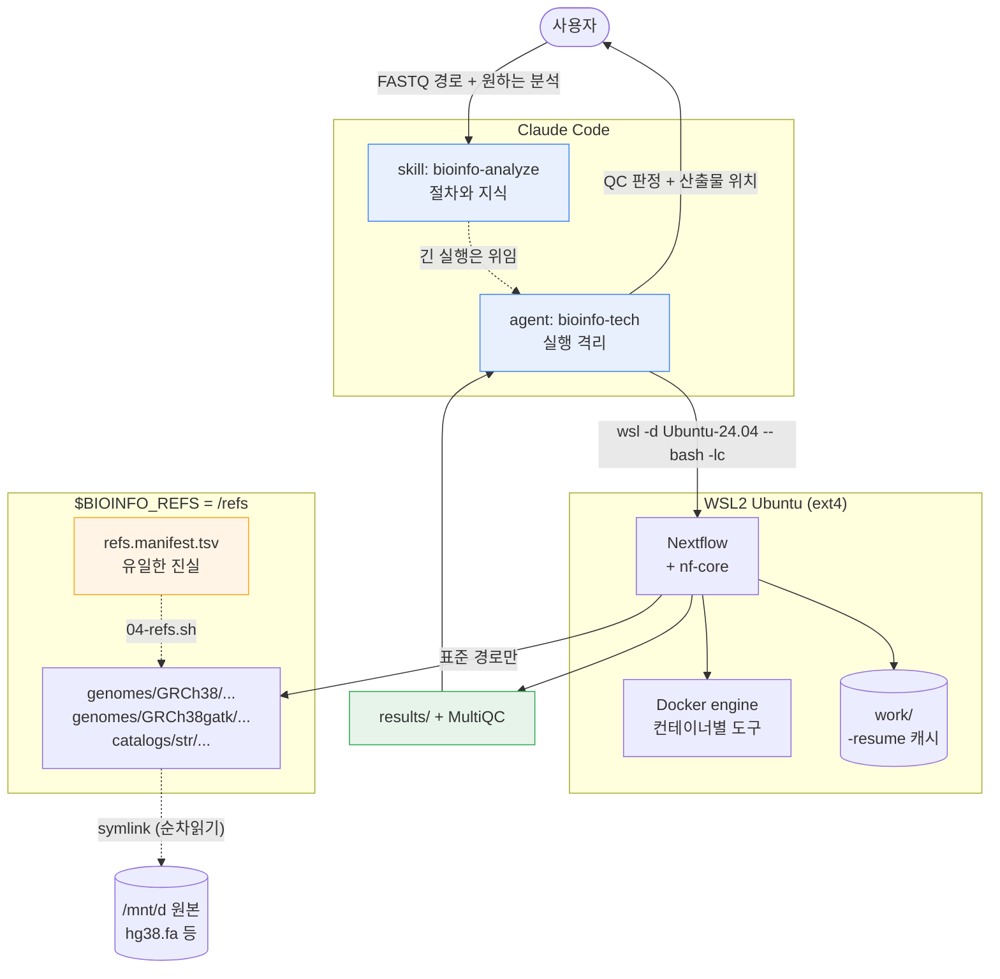

# bioinfo

nf-core 파이프라인을 로컬에서 실제로 돌리기 위한 자립형 환경. WSL2 리눅스 기반, 파이프라인을 제대로
굴리는 방법을 담은 스킬, 그리고 열두 시간짜리 Nextflow 로그를 대화창에 쏟아붓지 않고 대신 돌려주는
에이전트로 구성된다. 리포 안은 전부 텍스트다 — 스크립트, 설정, 지식. 그래서 새 컴퓨터에서 git clone 한
번과 bootstrap 실행만으로 같은 환경이 재현된다.

사람 유전체 작업을 전제로 만들었다. 단일염기 수준 WGS/WES, RNA-seq, 메틸화, ATAC/ChIP, 단일세포, 그리고
이 머신에 이미 레퍼런스가 갖춰져 있는 STR·반복서열 확장 분석과 한국인 집단 대립유전자빈도 비교까지.

**바로 찾아가기** — [설치한 다음 실제로 어떻게 시키는가](#설치한-다음--실제로-어떻게-시키는가) ·
[동작 구조](#동작-구조) · [사용 가능한 파이프라인](#사용-가능한-nf-core-파이프라인) ·
[sarek 예시](#예시-sarek-으로-germline-변이-찾기) ·
[다른 호스트로 옮기기](docs/other-hosts.md)

- **리포지토리**: [`ehojune/bioinfo-agent`](https://github.com/ehojune/bioinfo-agent) (public)
- **이 머신의 위치**: `D:\bioinfo-agent` == `/mnt/d/bioinfo-agent` (WSL)
- **영문판**: [README.en.md](README.en.md)

디렉토리 이름과 리포 이름은 같게 유지한다. `$BIOINFO_HOME`, 스킬 정션, `bootstrap/*.sh` 의 기본값이
모두 이 경로를 기준으로 잡히기 때문에, 폴더 이름만 바꾸면 26곳이 한꺼번에 어긋난다. 실제로 `bioinfo` →
`bioinfo-agent` 로 옮겼을 때 그렇게 됐다. 옮겨야 한다면 [경로 이름 바꾸기](#경로-이름-바꾸기) 절차를
따른다.

---

## 3층 구조

의도적으로 분리했다.

| 층 | 위치 | 정체 | 왜 따로 두는가 |
|---|---|---|---|
| **기반** | `bootstrap/`, `config/`, WSL2 배포판 `Ubuntu-24.04` | 리눅스, Docker 엔진, Java, Nextflow, `/refs` 레퍼런스 스토어 | 머신마다 다르고 계속 바뀐다. bootstrap 재실행으로 언제든 처음부터 다시 세울 수 있다. |
| **스킬** | `skills/bioinfo-analyze/` | 지식 — 어떤 질문에 어떤 파이프라인인지, 샘플시트 스키마, 자원 추정, QC 기준, 실패 유형 | 그냥 마크다운이다. 손으로 고치고 git으로 diff 보고, 다른 에이전트가 쓰거나 사람이 직접 읽어도 된다. 에이전트 프롬프트 안에 갇힌 지식은 grep이 안 된다. |
| **에이전트** | `agents/` | `bioinfo-tech` — 계획하고, stub 실행하고, 돌리고, 감시하고, 보고하는 서브에이전트 | 실행 격리. 네 시간짜리 `nextflow run`은 로그를 수만 줄 뱉는다. 서브에이전트 안에서 돌리면 그 트래픽이 거기 머물고 결론만 넘어온다. 메인 대화에서 돌리면 정작 생각하던 것들이 전부 밀려난다. |

이 분리가 진가를 발휘하는 건 뭔가 잘못됐을 때다. 파이프라인이 죽으면 스킬의 실패 유형 문서를 읽어서
진단하지, 매번 처음부터 원인을 재구성하지 않는다. 그리고 알아낸 해법은 다시 스킬에 적어 넣는다.
에이전트는 일회용이고, 스킬은 쌓인다.

**에이전트가 하지 않는 것**: QC 판정과 산출물 위치까지가 그의 일이다. 생물학적 해석은 안 한다.
"MultiQC 기준 duplication 8%, 전 샘플 통과"는 에이전트 몫이고, "따라서 이 유전자가 질환에서
상향조절된다"는 당신 몫이다.

---

## 리포 구성

```
bioinfo/
├── README.md                  이 문서
├── README.en.md               영문판
├── install.ps1                skills/ 와 agents/ 를 Claude 설정 폴더에 연결
├── .gitignore                 실행 산출물·work 디렉토리·레퍼런스를 git에서 제외
├── .gitattributes             *.sh 를 LF로 강제 (Windows 체크아웃이 bash를 깨뜨리지 않게)
├── .claude-plugin/            플러그인 패키징 (동작 확인됨)
├── bootstrap/                 번호순 멱등 셋업 스크립트 00 → 06
├── docs/
│   └── other-hosts.md         네이티브 리눅스 / 공용 서버 / 클러스터로 옮기기
├── config/
│   ├── local.config           executor, CPU/RAM 상한, 컨테이너 엔진, work 디렉토리
│   ├── genomes.config         게놈 빌드 이름 → $BIOINFO_REFS 경로 매핑
│   ├── refs.manifest.tsv      /refs 의 내용과 출처에 대한 유일한 진실
│   ├── host.env.example       머신을 옮길 때 고쳐야 할 변수 목록
│   └── wslconfig.example      WSL2 메모리 상한 (STAR 인덱스에 결정적)
├── skills/bioinfo-analyze/    SKILL.md + references/ + assets/
├── agents/                    bioinfo-tech 에이전트 정의
└── runs/                      분석 실행마다 디렉토리 하나 (gitignore 대상)
```

`/refs` 는 이 리포에 **없고 앞으로도 없다.** 수백 기가바이트짜리이고, WSL VHDX 안 ext4에 살며,
`config/refs.manifest.tsv` 로부터 `bootstrap/04-refs.sh` 가 재구성한다. 이식되는 건 매니페스트이지
바이트가 아니다.

---

## 새 컴퓨터에 세팅하기

public 리포이므로 clone에는 인증이 필요 없다.

```bash
git clone https://github.com/ehojune/bioinfo-agent.git D:\bioinfo-agent
```

**푸시에는 인증이 필요하다.** 그리고 그 인증은 사람이 한다 — 에이전트에게 토큰을 넘기지 않는다.
Windows의 기본 자격증명 헬퍼는 `manager`(Git Credential Manager)인데 브라우저나 대화형 창을 띄워야
하므로, 비대화형 세션에서 실행하면 응답 없이 멈춘다. 에이전트가 푸시까지 하게 하려면 WSL 쪽에
헬퍼를 한 번 심어둔다.

```bash
gh auth login --hostname github.com --git-protocol https --web
```

```bash
gh auth setup-git
```

`--hostname` 과 `--git-protocol` 을 주면 선택 메뉴가 건너뛰어지고 기기 코드 화면으로 바로 간다.
`wsl -d <distro> -- gh auth login` 처럼 한 줄로 던지면 TTY가 제대로 안 붙어 화살표 입력이 먹지 않을 수
있으니, WSL 셸에 먼저 들어가서 실행한다.

**public 리포라는 점을 의식할 것.** 이 저장소는 소속 기관이 쓰는 TLS 검사 장비 벤더명과 로컬 Windows
계정명, 내부 레퍼런스 경로를 담고 있다. 자격증명·토큰·IP·호스트명은 없다. 새로 뭘 적을 때 그 선을
지킨다.

**디렉토리 이름을 `bioinfo-agent` 로 유지할 것.** 다른 이름으로 clone 하면 아래 스크립트들의
`$BIOINFO_HOME` 기본값과 어긋난다. 굳이 바꾸려면 아래 [경로 이름 바꾸기](#경로-이름-바꾸기) 를 본다.

그다음 순서대로 실행한다. 모든 스크립트가 멱등이라 이미 끝난 단계를 다시 돌려도 재확인만 하고 넘어간다.

| # | 스크립트 | 실행 위치 | 소요 | 하는 일 |
|---|---|---|---|---|
| 00 | `bootstrap/00-windows-wsl.ps1` | Windows PowerShell | 10~20분 | VM Platform / WSL 기능 확인, `Ubuntu-24.04` 설치를 지정 드라이브에. `--no-launch` 로 받으므로 대화형 프롬프트가 뜨지 않는다. |
| 00.5 | `config/wslconfig.example` → `%USERPROFILE%\.wslconfig` | Windows | 1분 | **건너뛰지 말 것.** 이유는 바로 아래. |
| 01 | `bootstrap/01-wsl-base.sh` | WSL, root | 5~10분 | 사용자 생성 + NOPASSWD sudo, `/etc/wsl.conf`(systemd, 기본 사용자, `appendWindowsPath=false`), OpenJDK 17, git/curl/unzip/pigz/build-essential. |
| — | `wsl --terminate Ubuntu-24.04` | Windows | 즉시 | wsl.conf 변경은 재시작해야 먹는다. 안 하면 systemd가 PID 1이 안 되고 Docker가 안 뜬다. |
| 02 | `bootstrap/02-docker.sh` | WSL, root | 3~5분 | Docker **엔진** (Desktop 아님), docker 그룹, systemd 유닛, hello-world 확인. |
| 03 | `bootstrap/03-nextflow.sh` | WSL, 일반 사용자 | 2~5분 | Nextflow, nf-core 툴, `NXF_*` 환경변수를 전부 ext4로. |
| 06 | `bootstrap/06-tls-trust.sh` | WSL | 1분 | 사내망 TLS 검사 장비 탐지. 없으면 즉시 종료. 있으면 아래 참고. |
| 04 | `bootstrap/04-refs.sh` | WSL, 일반 사용자 | 수 초 ~ 15분 | 매니페스트를 읽어 `$BIOINFO_REFS` 구축. 심링크는 즉시, `copy` 모드 BWA 인덱스 약 5GB가 시간을 잡아먹는다. |
| 05 | `bootstrap/05-verify.sh` | WSL, 일반 사용자 | 1분 미만 | 전 계층 점검, 항목별 OK/MISSING/STALE 출력. 이게 깨끗해지기 전엔 설치가 끝난 게 아니다. |
| — | `install.ps1` | Windows PowerShell | 수 초 | 스킬과 에이전트를 Claude 설정 폴더에 연결. |

레퍼런스 파일이 이미 로컬에 있는 머신 기준 총 30~45분. 대부분 apt와 인덱스 복사 시간이다. 레퍼런스를
받아야 하는 머신이라면 시간 단위로 늘어나니 다운로드를 따로 계획해야 한다.

### 00.5를 건너뛰면 안 되는 이유

`.wslconfig` 가 없으면 WSL2는 호스트 메모리의 **50%만** 가져간다. 64GB 머신이면 31GB다. 그런데 사람
STAR 게놈 인덱스 빌드는 약 40GB를 요구한다. 부족하다는 경고 같은 건 안 나온다. 그냥 OOM으로 죽고
Nextflow는 exit 137이라는 불친절한 숫자만 남긴다. 한 시간 태우고 나서 알게 된다.

```
[wsl2]
memory=52GB
processors=22
swap=16GB
```

적용은 `wsl --shutdown` 후부터다. 이 머신 실측으로 **31GB → 50GB, 코어 22개**가 됐다.
`wsl -d Ubuntu-24.04 -- free -g` 의 total로 확인한다.

함정 둘. **`.wslconfig` 는 값 뒤 인라인 주석을 못 받는다.** `swap=16GB  # 여유분` 처럼 쓰면 그 키
전체가 거부된다. 주석은 반드시 별도 줄로. 그리고 **`sparseVhd` 는 넣지 말 것** — WSL 2.7.10이 `[wsl2]`
아래에서 이 키를 거부한다(깨끗한 LF 줄, 주석 없음에도). 필요하면 CLI로
`wsl --manage <distro> --set-sparse true` 를 쓰되, 이미 쓰고 있는 디스크에는 `--allow-unsafe` 를
요구하므로 그냥 안 쓰는 편이 낫다.

시작할 때 키 이름과 줄 번호가 찍힌 경고가 뜨면 그 키가 거부된 것이다. WSL은 뜨지만 설정은 안 먹는다.

### 다른 머신으로 옮겼을 때

1. `config/refs.manifest.tsv` 를 연다.
2. **세 번째 필드(source)** 만 그 머신의 레퍼런스 위치로 고친다. 첫 번째 컬럼은 건드리지 않는다.
   표준 경로가 계약이고 source는 로컬 사정일 뿐이다.
3. `bootstrap/04-refs.sh` 재실행.
4. `bootstrap/05-verify.sh` 재실행. 진짜로 없는 것들이 `MISSING` 으로 뜨는 건 정상이다 — 스크립트가
   일을 한 거지 실패한 게 아니다. `mode=fetch` 나 `mode=build` 로 채워 넣으면 된다.

### 경로 이름 바꾸기

리포 경로는 세 곳에 박혀 있고, 폴더 이름만 바꾸면 셋 다 조용히 어긋난다. `bioinfo` →
`bioinfo-agent` 로 옮길 때 실제로 그랬다. 순서대로 한다.

1. **리포 안의 경로 문자열.** `D:\<old>` 와 `/mnt/d/<old>` 가 26곳에 있었다. 재실행에 안전하게:

   ```bash
   git ls-files -z | xargs -0 perl -pi -e 's{/mnt/d/OLD(?!-NEWSUFFIX)}{/mnt/d/NEW}g; s{D:\x5cOLD(?!-NEWSUFFIX)}{D:\x5cNEW}g'
   ```

   Windows 경로의 백슬래시는 셸을 거치며 이스케이프가 어긋나기 쉬우니 `\x5c` 로 직접 쓴다.
   끝나면 `grep -rn 'OLD' .` 로 0건인지 확인한다.

2. **스킬 정션.** `~/.claude/skills/<skill>` 이 옛 경로를 가리키는 죽은 정션으로 남는다.
   `Test-Path` 는 정션 자체가 있으니 `True` 를 돌려주므로 이것만으로는 안 잡힌다.

   ```powershell
   .\install.ps1 -ExtraConfigDirs 'C:\Users\admin\.claude' -Force
   ```

   `-Force` 가 필요하다. 잘못된 곳을 가리키는 정션은 기본적으로 교체하지 않는다.

3. **WSL 환경 계약.** `~/.config/bioinfo/env.sh` 의 `BIOINFO_HOME` 이 옛 경로다.

   ```bash
   BIOINFO_HOME=/mnt/d/NEW bash /mnt/d/NEW/bootstrap/03-nextflow.sh
   ```

마지막으로 `bootstrap/05-verify.sh` 가 READY를 찍는지 본다. `/refs` 는 영향받지 않는다 — 매니페스트는
레퍼런스 원본(`/mnt/d/Research/...`)을 가리키고 리포 경로와 무관하다.

---

## 스킬과 에이전트 설치

**다른 걸 다 건너뛰더라도 이건 읽어야 한다.** Claude Code의 스킬과 에이전트는 **디스크 위의 로컬
파일**이다. Anthropic 계정에 붙어 있지 않고 동기화도 안 된다. 새 컴퓨터에서 Claude Code에 로그인하면
모델은 따라오지만 `bioinfo-analyze` 와 `bioinfo-tech` 는 안 따라온다. 아래 둘 중 하나를 그 컴퓨터에서
실행하기 전까지 그 에이전트는 존재하지 않는다. 이걸로 당황하는 사람이 많다. 작업 시작 직전에 알게
되지 말 것.

### (a) `install.ps1` — 정션 방식. 이 머신에서 동작 확인됨.

```powershell
cd D:\bioinfo-agent
.\install.ps1 -WhatIf
.\install.ps1
```

스킬마다 `<config>\skills\<name>` 에 디렉토리 **정션**을 만든다. 심볼릭 링크가 아니라 정션인 이유는
정션은 관리자 권한도 개발자 모드도 필요 없기 때문이다. D: 의 리포가 유일한 정본으로 남아서, 파일을
고치면 Claude가 즉시 반영된 걸 본다. 재설치가 필요 없다.

설정 폴더 결정 순서: `$env:CLAUDE_CONFIG_DIR` 이 있으면 그것, 없으면 `$env:USERPROFILE\.claude`.

이 머신에는 Windows 프로필이 둘(`쫀득쿠키`, `admin`) 있으니 하나의 정본에서 양쪽으로 연결한다.

```powershell
.\install.ps1 -ExtraConfigDirs 'C:\Users\admin\.claude'
```

**스킬은 모든 설정 폴더에 들어가지만 에이전트는 첫 번째(primary)에만 들어간다.** Claude Code가 스킬은
이름으로 중복 제거하는데 에이전트는 안 하기 때문이다. 양쪽에 에이전트 파일을 두면 선택 목록에 똑같은
게 두 번 뜬다. 이 머신에서 실제로 그랬다 — 작업 폴더가 `C:\Users\admin\llm-wiki` 라서 Claude가 상위
경로를 훑다가 `C:\Users\admin\.claude` 를 프로젝트 설정으로 잡고, 거기 있던 에이전트가 user-level 것과
겹쳤다. 굳이 양쪽에 넣어야 하면 `-AgentsEverywhere` 를 붙인다.

기존 폴더를 덮어쓰지 않는다. `<config>\skills\bioinfo-analyze` 가 실제 디렉토리로 이미 있거나 다른 곳을
가리키는 정션이면 멈추고 알려준다. `-Force` 는 **잘못된 정션**만 교체한다.

### (b) 플러그인 마켓플레이스 — **동작 확인됨. 새 머신에서는 이쪽을 쓴다.**

```bash
claude plugin marketplace add ehojune/bioinfo-agent
```

```bash
claude plugin install bioinfo@bioinfo
```

실제 출력:

```
✔ Successfully added marketplace: bioinfo (declared in user settings)
✔ Successfully installed plugin: bioinfo@bioinfo (scope: user)
```

확인:

```bash
claude plugin details bioinfo@bioinfo
```

```
bioinfo 0.1.0
Component inventory
  Skills (1)  bioinfo-analyze
  Agents (1)  bioinfo-tech
Projected token cost
  Always-on:   ~521 tok   added to every session
```

`skills/` 와 `agents/` 를 자동 발견하므로 `plugin.json` 에 경로 배열을 적을 필요가 없었다. 상시 비용은
521 토큰이고, 스킬이나 에이전트가 실제로 발동할 때 각각 2k 정도가 추가로 든다.

Claude Code 대화 안에서라면 슬래시 형태도 같다: `/plugin marketplace add ehojune/bioinfo-agent`.

**두 방식을 같이 쓰지 말 것.** 정션과 플러그인이 같은 스킬을 각각 등록하면 중복으로 잡힌다. 이 머신은
정션(a)을 쓰고, 다른 머신은 플러그인(b)을 쓴다.

---

## 설치한 다음 — 실제로 어떻게 시키는가

플러그인을 깔았다고 뭐가 자동으로 돌지는 않는다. 세 가지 방식이 있다.

### 1. 그냥 말한다 (평소 쓰는 방식)

스킬은 설명문에 걸린 트리거로 **자동 발동**한다. 별도 명령이 필요 없다.

```
~/data/rnaseq 에 FASTQ 8개 있어. 마우스 간조직이고 대조군 4 처리군 4야.
발현 차이 보고 싶은데 돌려줘.
```

`FASTQ`, `RNA-seq`, 발현 차이 같은 표현에서 `bioinfo-analyze` 가 뜨고, 접수 질문부터 시작한다.

### 2. 이름으로 명시한다

트리거가 애매할 때, 또는 확실히 그 절차를 밟게 하고 싶을 때.

```
/bioinfo-analyze
```

```
bioinfo-analyze 스킬 써서 이 samplesheet 검증해줘
```

### 3. 에이전트에 위임한다 (긴 실행에는 이쪽)

```
bioinfo-tech 에이전트한테 sarek 돌리라고 시켜줘
```

**몇 시간짜리 실행은 반드시 이 방식을 쓴다.** `nextflow run` 은 로그를 수만 줄 뱉는데, 서브에이전트
안에서 돌면 그게 거기서 소화되고 결론만 돌아온다. 메인 대화에서 돌리면 그 로그가 컨텍스트를 밀어내
정작 하던 논의가 사라진다.

### 무엇을 주면 되는가

에이전트가 계획을 세우기 전에 알아야 하는 것들이다. 모르면 물어보지만, 미리 주면 왕복이 줄어든다.

| 항목 | 예시 |
|---|---|
| 데이터 절대경로 | `~/data/wgs/` 또는 `/mnt/e/proj/fastq/` |
| 몇 샘플, 어떤 형식 | 12샘플, paired-end, `fastq.gz`, PE150 |
| 종과 게놈 빌드 | human GRCh38 / 이미 있는 `GRCh38gatk` 씀 |
| 실제 질문 | "희귀변이 찾기" vs "발현 차이" — 여기서 파이프라인이 갈린다 |
| 설계 | 그룹, 반복수, 배치, tumour/normal 짝 |
| 시간 허용치 | 하룻밤 OK / 24시간 넘으면 안 됨 |
| 기존 산출물 | 이전 BAM, 만들어둔 인덱스, 중단된 실행의 work 디렉토리 |

데이터 경로만 줘도 시작은 한다. `ls -l` 로 직접 세어보고 FASTQ 헤더까지 읽어서 나머지를 추정한 뒤
확인을 요청한다.

---

## 동작 구조



읽는 순서는 이렇다. 사용자가 데이터와 목적을 준다 → 스킬이 절차를 잡고 긴 실행은 에이전트에 넘긴다 →
에이전트가 WSL 안에서 Nextflow를 띄운다 → Nextflow가 도구마다 Docker 컨테이너를 받아 돌리고 work
디렉토리에 캐시를 쌓는다(`-resume` 의 근거) → 레퍼런스는 반드시 `/refs` 표준 경로로만 참조하고, 그
표준 경로는 매니페스트가 원본 파일로 이어준다 → 결과와 MultiQC가 나오면 에이전트가 판정만 만들어
돌려준다.

### 7단계 절차

| # | 단계 | 산출물 |
|---|---|---|
| 1 | **접수** | 파일을 직접 본다. 설명을 믿지 않는다 |
| 2 | **파이프라인 선정** | 파이프라인 + 고정 리비전, 그리고 그걸 고른 이유 한 줄 |
| 3 | **실행 계획서 + 승인** | `runs/<runid>/plan.md` — 예상 시간·디스크, 없는 레퍼런스, 임의로 좁힌 범위 |
| 4 | **사전점검 + stub 실행** | 디스크 1.5배 확인, 샘플시트 검증, `-stub-run` 통과 |
| 5 | **실행** | 백그라운드, 로그 파일, ext4 work 디렉토리 |
| 6 | **QC 판정** | 샘플별 PASS / PASS WITH CAVEATS / FAIL |
| 7 | **인계** | `runs/<runid>/handoff.md` |

3번에서 멈춰서 승인을 기다린다. 24시간 넘는 작업, 10GB 넘는 다운로드는 승인 없이 시작하지 않는다.

### 1~3단계는 아무것도 실행하지 않는다

계획서가 승인되기 전에 허용되는 건 **읽기 전용 조사**뿐이다.

| 1~3단계에서 허용 | 승인 전 금지 |
|---|---|
| `ls`, `du -sh`, `df -h`, `find`, `file` | `samtools`, `bcftools`, `gatk`, `bwa` — 모든 분석 도구 |
| FASTQ 헤더 몇 줄 (`zcat \| head`) | BAM/CRAM/FASTQ 전체를 읽는 모든 것 |
| 로그·스크립트·기존 샘플시트 읽기 | `nextflow run` (4단계의 `-stub-run` 제외) |

50GB BAM을 "확인하려고" 열지 않는다. 존재·크기·수정시각만 기록하고, **검증은 계획서에 항목으로 넣어
제안한다.** 접수 단계에서 승인 프롬프트가 뜨면 사용자 입장에선 분석이 이미 시작된 것처럼 보이는데,
사실도 아니고 놀랄 일이다.

### 손으로 재현하지 않는다

요청이 9개 파이프라인 중 하나에 해당하면 **그 파이프라인을 돌린다.** `bwa mem` + `samtools sort` +
`gatk MarkDuplicates` + `ApplyBQSR` 를 직접 엮지 않는다. 그게 sarek이고, 손으로 하면 재현성도
`-resume` 도 MultiQC도 없다. **디렉토리에 그 중간 산출물이 이미 있어서 수동으로 마무리하는 게 빨라
보일 때 특히 그렇다.**

디스크에서 찾은 바이너리도 실행하지 않는다. 남의 프로젝트 폴더에 컴파일돼 있는 `samtools-1.22.1` 은
빌드 방식도 버전도 알 수 없고, 그걸 쓰면 `-profile docker` 를 쓰는 이유가 사라진다.

### 이미 있는 산출물은 이렇게 재사용한다

찾아보는 건 옳다. 문제는 찾은 다음이다.

| 발견한 것 | 잘못된 대응 | 올바른 대응 |
|---|---|---|
| BQSR까지 끝난 BAM/CRAM | `samtools`/`gatk` 로 이어서 수동 진행 | sarek `--step variant_calling`, 샘플시트에 `bam`/`bai` 컬럼 |
| 중복 표시된 BAM | 손으로 계속 | sarek `--step prepare_recalibration` |
| trim된 FASTQ | 다시 trim | `fastq_1`/`fastq_2` 로 넣고 trimming 단계를 플래그로 건너뜀 |
| VCF만 있음 | bcftools 원라이너 | sarek `--step annotate` |
| 기존 STAR/BWA 인덱스 | 다시 빌드 | 매니페스트에 행 추가 → 표준 경로로 참조 |

전부 **파이프라인 자체의 재시작 기능을 통과한다.** 사람이 멈춘 자리를 이어받는 게 아니다. 그래야
결과가 재현 가능하고 `-resume` 이 된다.

출처를 모르는 산출물이라면 계획서에 그 사실을 적고 신뢰할지는 사용자가 정한다. 다른 파이프라인의
중간 결과를 말없이 자기 것처럼 쓰지 않는다.

---

## 사용 가능한 nf-core 파이프라인

스킬이 **깊이 다루는** 9개다. 샘플시트 스키마, 자원 추정, QC 기준, 실패 유형까지 문서화돼 있다.

| 파이프라인 | 무엇을 하는가 | 최소 입력 | 주 산출물 |
|---|---|---|---|
| **rnaseq** | bulk RNA-seq 정량 (STAR+Salmon 기본) | FASTQ + `strandedness` | `salmon.merged.gene_counts.tsv` |
| **differentialabundance** | 발현 차이 검정 (DESeq2) | rnaseq 카운트 행렬 + `contrasts.csv` | HTML 리포트, DE 결과표 |
| **fetchngs** | SRA/ENA/GEO 공개 데이터 내려받기 | 액세션 목록 (`SRR`, `PRJNA`, `GSE`…) | FASTQ + 다음 파이프라인용 샘플시트 |
| **sarek** | germline / 체세포 변이 검출 (WGS·WES·패널) | FASTQ 또는 BAM/CRAM | VCF, 정렬 CRAM |
| **methylseq** | 메틸화 (WGBS / RRBS / EM-seq) | FASTQ | CpG 메틸화율, bisulfite 전환율 |
| **atacseq** | 염색질 접근성 | FASTQ + `replicate` | consensus peak, bigWig |
| **chipseq** | ChIP-seq | FASTQ + `antibody`, `control` | peak, FRiP |
| **cutandrun** | CUT&RUN / CUT&Tag | FASTQ + `control` | peak (SEACR/MACS2) |
| **scrnaseq** | 단일세포 RNA | FASTQ + `expected_cells` | count matrix, h5ad |

**그 밖의 파이프라인은 요청 시점에 조달한다.** nf-core에는 100개 넘게 있고 전부 미리 문서화하는 건
낭비이자 부패의 원인이다. 절차는 [new-pipeline.md](skills/bioinfo-analyze/references/new-pipeline.md)
에 있다.

```bash
nf-core pipelines list
```

조달 시 성숙도, 최근 릴리스 시점, 아카이브 여부, 컨테이너 유무를 먼저 보고, `-profile test` 가 이
머신에서 통과하는지 확인한 다음 리비전을 고정한다.

### 이 스택으로 커버되지 **않는** 것

솔직하게 적어둔다. 이게 없으면 헛돌게 된다.

- **STR / 반복서열 확장** — `sarek` 은 반복 확장을 호출하지 않는다. ExpansionHunter, TRGT, HipSTR은
  별도 도구다. 카탈로그는 `/refs/catalogs/str/` 에 이미 있고, `sarek --step mapping` 으로 CRAM을 만든
  다음 STR 도구를 따로 돌리는 흐름이 된다. `Ubuntu-legacy` 배포판의 `expansion`, `ephdn` conda 환경이
  그 용도다.
- **롱리드** (ONT, PacBio HiFi) — 위 9개는 전부 일루미나 숏리드 전제다. TRGT는 HiFi 전용이다.
- **생물학적 해석** — 에이전트는 QC 판정까지다.

---

## 예시: sarek 으로 germline 변이 찾기

가장 많이 묻는 게 이거라 실제 값으로 적는다. 아래는 **리비전 3.9.0 스키마를 직접 읽어서** 확인한
내용이다 (`assets/schema_input.json`, `nextflow_schema.json`).

### 대화는 이렇게 시작하면 된다

```
/mnt/e/proj/wgs 에 WGS FASTQ 6샘플 있어. human, 30x 정도.
희귀질환 후보 변이 찾으려고 해. germline이고 tumour는 없어.
sarek 돌려줘.
```

에이전트가 파일을 직접 세어보고, 없는 레퍼런스를 짚고, 예상 시간과 디스크를 계산해서 계획서를 낸다.
**6샘플 30x WGS는 이 머신에서 일주일 넘는 작업**이라 그 사실부터 말하고 대안을 제시한다.

### 입력 — 샘플시트

`patient` 와 `sample` **두 개만 필수**다. 나머지는 상황에 따라 붙인다.

```csv
patient,sample,sex,status,lane,fastq_1,fastq_2
FAM01,FAM01-proband,XY,0,L001,/mnt/e/proj/wgs/P1_L001_R1.fastq.gz,/mnt/e/proj/wgs/P1_L001_R2.fastq.gz
FAM01,FAM01-proband,XY,0,L002,/mnt/e/proj/wgs/P1_L002_R1.fastq.gz,/mnt/e/proj/wgs/P1_L002_R2.fastq.gz
FAM01,FAM01-father,XY,0,L001,/mnt/e/proj/wgs/F1_L001_R1.fastq.gz,/mnt/e/proj/wgs/F1_L001_R2.fastq.gz
FAM01,FAM01-mother,XX,0,L001,/mnt/e/proj/wgs/M1_L001_R1.fastq.gz,/mnt/e/proj/wgs/M1_L001_R2.fastq.gz
```

| 컬럼 | 필수 | 의미 |
|---|---|---|
| `patient` | ✅ | 개인/가족 묶음. 같은 `patient` 안에서 tumour/normal 짝이 맺힌다 |
| `sample` | ✅ | 샘플 식별자. 한 `patient` 에 여러 샘플 가능 |
| `sex` | | `XX` / `XY` / `NA`. 성염색체 처리와 sex-check에 쓰인다 |
| `status` | | `0` = normal, `1` = tumour. 생략하면 0 |
| `lane` | | **여러 레인이면 반드시 넣는다.** read group이 갈려서 중복 표시가 정확해진다 |
| `fastq_1` / `fastq_2` | | FASTQ부터 시작할 때 |
| `bam`/`bai`, `cram`/`crai` | | 정렬된 것부터 시작할 때 (`--step markduplicates` 등) |
| `vcf`, `variantcaller` | | 어노테이션만 할 때 (`--step annotate`) |

같은 `patient`+`sample` 에 `lane` 만 다른 행을 여러 개 두면 자동으로 병합된다. 위 예시의 proband가
그렇다.

### 레퍼런스 — 세 가지 방식

이게 질문의 핵심이다. **셋 다 유효하고, 셋 중 어느 쪽인지 계획서에 명시된다.**

#### (A) nf-core가 알아서 — 기본값

`--genome` 의 기본값이 이미 `GATK.GRCh38` 이고, `--igenomes_base` 는
`s3://ngi-igenomes/igenomes` 를 가리킨다. **아무것도 안 주면 AWS에서 받아온다.**

```bash
nextflow run nf-core/sarek -r 3.9.0 -profile docker \
  --input samplesheet.csv --outdir results --tools haplotypecaller
```

동작은 한다. 대신 fasta·인덱스·GATK 번들을 수십 GB 내려받고, 어디서 뭘 썼는지 통제가 안 된다.
VEP/snpEff 캐시도 기본이 S3 경로다. **에이전트는 이 경로를 기본으로 고르지 않는다** — 10GB 넘는
다운로드는 승인 대상이기 때문에 먼저 물어본다.

#### (B) 로컬 레퍼런스를 명시 — 이 머신의 기본

레퍼런스 스토어에 이미 있는 것을 표준 경로로 넘긴다. 원본 파일명(`hg38.fa` 등)은 절대 쓰지 않는다.

```bash
REFS=${BIOINFO_REFS:-/refs}/genomes/GRCh38gatk
nextflow run nf-core/sarek -r 3.9.0 -profile docker \
  -c $BIOINFO_HOME/config/local.config \
  --input samplesheet.csv --outdir results \
  --fasta     $REFS/fasta/genome.fa \
  --fasta_fai $REFS/fasta/genome.fa.fai \
  --dict      $REFS/fasta/genome.dict \
  --bwa       $REFS/index/bwa \
  --dbsnp        $REFS/gatkbundle/dbsnp.vcf.gz \
  --known_indels $REFS/gatkbundle/known_indels.vcf.gz \
  --tools haplotypecaller --joint_germline
```

**이 머신의 실제 상태** (`bootstrap/04-refs.sh` 가 매번 알려준다):

| 필요한 것 | 상태 | 비고 |
|---|---|---|
| `fasta/genome.fa` + `.fai` | ✅ 있음 | GATK analysis set, no ALT/HLA/decoy |
| `index/bwa/` | ✅ 있음 | ext4로 복사됨 (drvfs 랜덤액세스가 느려서) |
| `fasta/genome.dict` | ❌ **없음** | `gatk CreateSequenceDictionary` 2분. 없으면 sarek이 시작조차 안 한다 |
| `gatkbundle/dbsnp` · `known_indels` | ❌ **없음** | BQSR과 HaplotypeCaller에 필요. 수 GB 다운로드 |
| `gatkbundle/germline_resource` | ❌ 없음 | Mutect2 체세포 변이용. germline만 하면 불필요 |
| `cache/vep` 또는 `snpeff` | ❌ 없음 | `--tools vep` 쓸 때만. GRCh38 기준 ~25GB |

즉 **지금 당장 sarek germline을 완주할 수는 없다.** `.dict` 생성과 GATK 번들 확보가 선행 조건이고,
에이전트는 이걸 12시간 뒤가 아니라 계획서 단계에서 말한다.

#### (C) 갖고 있는 걸 대화로 알려주기 — 권장

**네, 알아서 참조합니다.** 그게 레퍼런스 스토어를 만든 이유다.

```
dbsnp 파일 /mnt/e/refs/dbsnp_146.hg38.vcf.gz 여기 있어. 이거 써.
```

에이전트가 하는 일:

1. `config/refs.manifest.tsv` 에 행 하나를 추가한다
   ```
   genomes/GRCh38gatk/gatkbundle/dbsnp.vcf.gz	link	/mnt/e/refs/dbsnp_146.hg38.vcf.gz
   ```
2. `bootstrap/04-refs.sh` 를 돌려 표준 경로에 심링크를 건다
3. 그 뒤로는 **`--dbsnp $REFS/gatkbundle/dbsnp.vcf.gz` 만 쓴다.** 원본 경로는 다시 등장하지 않는다

이 간접층이 있어야 컴퓨터를 옮길 때 매니페스트의 source 컬럼만 고치면 끝난다. 파일을 손으로
`/refs` 에 갖다 놓으면 그 정보가 매니페스트에 없어서 다음 머신에서 사라진다. **에이전트는 손으로
갖다 놓지 않는다.**

### 주요 파라미터 (3.9.0 확인)

```
--step     mapping | markduplicates | prepare_recalibration | recalibrate
           | variant_calling | annotate            (기본: mapping)

--tools    haplotypecaller  deepvariant  strelka  freebayes  mpileup  lofreq
           mutect2  muse  varlociraptor            (변이 검출)
           manta  tiddit  cnvkit  ascat  controlfreec   (구조변이 / CNV)
           msisensorpro  msisensor2  ngscheckmate  indexcov
           vep  snpeff  snpsift  bcfann            (어노테이션)
           sentieon_dedup  sentieon_haplotyper  sentieon_dnascope  sentieon_tnscope
                                                  (라이선스 필요)

--wes                 exome/패널일 때 켠다
--intervals <bed>     캡처 영역. WES에서 이걸 빼면 전체 게놈을 훑어 몇 배 느려진다
--joint_germline      GATK HaplotypeCaller 조인트 콜링 (가족 분석에 쓴다)
--save_reference      만든 인덱스를 저장 → 다음 실행에서 재사용
--build_only_index    인덱스만 만들고 끝. 사전 준비용
```

`--step` 은 재시작에 쓴다. 정렬까지 끝난 CRAM이 있으면 `--step variant_calling` 으로 앞단을 건너뛴다.
샘플시트에 `cram`/`crai` 컬럼을 채워 넣으면 된다.

### 소요 시간 — 먼저 알아야 하는 숫자

이 머신(22코어, 50GB RAM, ext4)에서 대략 이렇다.

| 작업 | 샘플당 | 비고 |
|---|---|---|
| WES 100x, haplotypecaller | 4~8시간 | `--wes --intervals` 필수 |
| **WGS 30x, haplotypecaller** | **하루 이상** | 6샘플이면 일주일 넘는다 |
| WGS 30x + SV/CNV 도구 추가 | 1.5~2배 | `--tools` 를 늘릴수록 곱해진다 |
| `.dict` 생성 | 2분 | 1회 |
| GATK 번들 다운로드 | 회선에 따라 | 1회, 수 GB |

**로컬 WGS 코호트는 현실적이지 않다.** 그럴 때 에이전트가 제시하는 대안은 이렇다 — 샘플 줄이기,
WES로 바꾸기, `--tools` 줄이기, 아니면 클러스터가 필요하다고 결론 내기. 조용히 시작해서 일주일 뒤에
알게 하지 않는다.

### 스키마는 버전마다 바뀐다

위 표는 3.9.0 기준이다. 다른 리비전을 쓸 거면 그 리비전에서 직접 뽑아 확인한다.

```bash
nextflow info nf-core/sarek                      # 사용 가능한 리비전
nextflow run nf-core/sarek -r <rev> --help
```

에셋 경로는 Nextflow 26.x에서 **커밋 sha별 디렉토리**로 바뀌었으니 글롭으로 잡는다.

```bash
cat $NXF_ASSETS/.repos/nf-core/sarek/clones/*/assets/schema_input.json
```

경로를 외워 쓰지 말고 못 찾으면 이렇게 찾는다.

```bash
find "$NXF_ASSETS" -path '*nf-core/sarek*' -name schema_input.json | head -1
```

---

## 트러블슈팅

이론을 세우기 전에 항상 여기부터.

```bash
bash /mnt/d/bioinfo-agent/bootstrap/05-verify.sh
```

배포판, systemd, Docker 데몬, Java, Nextflow, `$BIOINFO_REFS` 내용, ext4 여유 공간까지 훑고 항목별로
판정을 찍는다. "파이프라인이 깨졌다"는 신고의 대부분은 아래 중 하나다.

| 증상 | 대개 이것 |
|---|---|
| 게놈 경로에서 파일 없음 | 매니페스트 행이 `MISSING` 이거나 source가 이동했다. source 컬럼 고치고 `04-refs.sh` 재실행. `/refs` 에 손으로 파일을 갖다 놓지 말 것. |
| 이유 없이 전부 5~10배 느림 | 뜨거운 뭔가가 `/mnt/d` 에 있다. work 디렉토리, 컨테이너 캐시, 아니면 인덱스 파일이 복사 대신 심링크로 남아 있다. ext4로 옮긴다. |
| `Cannot connect to the Docker daemon` | `01-wsl-base.sh` 가 wsl.conf를 쓴 뒤 배포판을 재시작하지 않아 PID 1이 systemd가 아니다. `wsl --terminate Ubuntu-24.04` 후 다시 진입. |
| `docker: permission denied` | docker 그룹 변경은 **새 로그인 셸부터** 적용된다. 배포판을 terminate 한다. |
| Windows에서 `docker` 명령 없음 | 정상이다. Docker Desktop을 안 깐다. Docker는 WSL 배포판 안에만 있다. `wsl -d Ubuntu-24.04` 로 들어가서 쓴다. |
| `curl: (60) SSL certificate problem` | 사내망 TLS 검사 장비. `bootstrap/06-tls-trust.sh` 참고. 아래 별도 항목. |
| exit 137 (특히 STAR 인덱스에서) | 십중팔구 WSL 메모리 상한이다. `.wslconfig` 를 안 만들었으면 31GB밖에 못 쓴다. 파이프라인 탓하기 전에 `free -g` 부터. |
| 중간에 죽음 | `-resume`. 항상. **work 디렉토리를 절대 지우거나 청소하지 말 것.** 그게 resume을 가능하게 하는 물건이고, 지우면 10분 재개가 전체 재실행이 된다. |
| 실행 중 디스크 부족 | VHDX가 1TB 상한에 닿았거나 호스트 D: 가 찼다. 둘 다 확인. 추정치의 1.5배 미만이면 시작 거부가 원칙이므로, 이게 났다면 추정이 틀린 것이다. 그렇다고 말할 것. |
| Claude에 `bioinfo-tech` 에이전트가 없음 | 그 머신에서 설치 절차를 안 돌린 것이다. 위 참고. |

### WSL 배포판이 안 보일 때

**WSL 배포판 등록은 Windows 계정별(HKCU)이다.** 다른 Windows 계정으로 설치한 배포판은 `wsl -l -v` 에
아예 안 나온다. 배포판이 없다고 결론 내리기 전에 디스크에서 직접 찾아본다.

```powershell
Get-ChildItem C:\Users, D:\, E:\ -Recurse -Filter "ext4.vhdx" -Force -ErrorAction SilentlyContinue
```

찾았다면 `wsl --import-in-place <이름> <경로>` 로 붙일 수 있다. 단 **반드시 사본에 대고** 한다. 하나의
VHDX를 두 계정에 등록해두고 양쪽에서 부팅하면 파일시스템이 깨진다.

### 사내망 TLS 검사

기관 네트워크가 TLS를 종료하고 사설 CA로 재서명하는 경우가 많다. Windows 브라우저는 그 CA가 Windows
신뢰 저장소에 있어서 멀쩡하지만, 갓 만든 WSL 배포판은 그걸 모른다.

성가신 점은 **선택적**이라는 것이다. 흔한 도메인은 통과시키고 덜 알려진 것만 검사한다. 이 리포를 만든
머신에서는 github.com과 pypi.org는 멀쩡한데 get.nextflow.io만 ePrism SSL(SOOSAN INT)에 걸렸다. 그러니
"다운로드 몇 개는 되는데"가 안전하다는 뜻이 아니다.

그리고 **신뢰 저장소가 하나가 아니라 셋이다.** 이걸 놓치기 쉽다.

- **시스템** — curl, apt, git (`update-ca-certificates`)
- **Java** — Nextflow 본체. JVM은 시스템 저장소를 아예 안 본다 (`keytool`, cacerts)
- **Python** — nf-core 툴. certifi가 자체 번들을 쓴다 (`REQUESTS_CA_BUNDLE`, `SSL_CERT_FILE`)

시스템만 고치면 curl은 되는데 Nextflow가 파이프라인을 못 받는 상태가 된다.

```bash
bash bootstrap/06-tls-trust.sh            # 탐지만, 아무것도 설치 안 함
bash bootstrap/06-tls-trust.sh --accept   # 발견한 CA를 세 저장소에 설치 (sudo 필요)
```

기본은 보고만 한다. 검사 장비의 CA를 신뢰한다는 건 그 장비가 이 머신의 TLS를 들여다볼 수 있다는
뜻이니, 출력된 발급자를 확인하고 조직 장비가 맞을 때만 `--accept` 를 붙인다. `curl -k` 로 검증을 끄는
건 해결이 아니다.

---

## 부록 — 이 머신의 실측값

위는 일반론이고 여기는 구체적 인스턴스다. 전부 측정값이다.

**호스트**

- Windows 11 Pro build 26200. 논리 코어 24개, RAM 63.5GB.
- `C:` 74GB 여유 — **빠듯하다. 절대 쓰지 않는다.** work 디렉토리도 캐시도 산출물도 금지.
- `D:` 2.2TB 여유 — 리포, 레퍼런스, VHDX.
- `E:` 3.7TB 여유 — 대용량 데이터와 보관.

**WSL 배포판**

| 배포판 | VHDX | 크기 | 역할 |
|---|---|---|---|
| `Ubuntu-24.04` | `D:\wsl\ubuntu-24.04\ext4.vhdx` | 상한 1TB, 내부 935GB 여유 | **파이프라인 기반.** 전부 여기서 돈다. |
| `Ubuntu-legacy` | `D:\wsl\legacy\ext4.vhdx` | 31.5GB | 기존 환경의 읽기 전용 사본. Ubuntu 22.04, `/home/ehojune` 28GB, anaconda3 (`expansion`, `ephdn`, `kinship`, `wgrs`, `cmake` 환경), `/usr/local/bin` 에 bcftools·king·aws CLI, `y_str` 1.1GB. 옛 스크립트와 데이터를 꺼내오는 용도. **여기서 파이프라인을 돌리지 말 것.** |

`Ubuntu-24.04` 내부: 사용자 `ehojune` (uid 1000, sudo, NOPASSWD). `/etc/wsl.conf` 에 `systemd=true`,
기본 사용자 `ehojune`, `appendWindowsPath=false`. OpenJDK 17.0.19. Docker 엔진 29.6.2, data-root는 기본값
`/var/lib/docker` 인데 이미 D: VHDX 안이라 옮길 게 없다. Nextflow 26.04.6, nf-core 4.0.3.

**경로 변환**: `D:\bioinfo-agent` (Windows) == `/mnt/d/bioinfo-agent` (WSL). 지금 있는 셸에 맞는 형식으로 쓴다.

**편의보다 우선하는 성능 규칙**: `/mnt/c`, `/mnt/d`, `/mnt/e` 는 Windows drvfs를 거치므로 배포판 네이티브
ext4보다 대략 5~10배 느리다. Nextflow work 디렉토리, 컨테이너 이미지, 랜덤 액세스가 많은 인덱스 파일은
무조건 ext4에 둔다. 순차 읽기 레퍼런스만 `/mnt/d` 로 심링크해도 된다.

**레퍼런스 스토어 — 로컬에 있고 매니페스트로 연결됨, 다운로드 불필요**

- UCSC `hg38.fa` + `.fai`
- GATK analysis set `Homo_sapiens_assembly38_noALT_noHLA_noDecoy.fasta` + `.fai` + BWA 인덱스 일습
  (`.amb .ann .bwt .pac .sa`) — sarek이 써야 할 빌드이고 `GRCh38gatk` 로 노출된다
- GENCODE v50 annotation GTF와 genes BED
- KOREF1 한국인 참조 어셈블리 + chrY
- HipSTR reference BED, TRGT 전체·병원성 반복 카탈로그, ExpansionHunter 전체·질환 좌위 카탈로그

**레퍼런스 스토어 — 진짜로 없는 것. 실행 계획서에 미리 적을 것. 12시간 뒤에 발견하지 말 것.**

- 두 빌드 모두 sequence `.dict` 없음 — `gatk CreateSequenceDictionary` 2분이면 되지만 없으면 sarek이
  시작조차 안 한다
- STAR, salmon, bismark 인덱스 없음 — 첫 RNA-seq/methylseq 실행이 빌드 비용을 문다 (약 1시간, 사람 STAR는
  ~40GB RAM). `--save_reference` 로 한 번만 내게 한다
- GATK resource bundle: dbsnp, known_indels, af-only gnomAD. BQSR과 HaplotypeCaller에 필요. 수 GB 다운로드
- VEP 또는 snpEff 캐시 — GRCh38 기준 ~25GB, 어노테이션할 때만 필요

**스킬이 깊이 다루는 파이프라인**: `nf-core/rnaseq`, `differentialabundance`, `fetchngs`, `sarek`,
`methylseq`, `atacseq`, `chipseq`, `cutandrun`, `scrnaseq`. 그 밖은 요청 시점에 조달한다
([new-pipeline.md](skills/bioinfo-analyze/references/new-pipeline.md)).

---

## 가드레일

스킬과 에이전트가 강제하는 항목. 이게 이 프로젝트의 핵심이라 여기 다시 적는다.

- 추정 **24시간**을 넘는 작업은 명시적 승인 없이 시작하지 않는다.
- **stub-run / `-preview`** 검증 단계를 건너뛰지 않는다.
- **work 디렉토리를 지우거나 청소하지 않는다.** `-resume` 이 죽는다.
- 여유 디스크가 추정치의 **1.5배** 미만이면 시작을 거부한다.
- 재시작은 항상 `-resume`. 조용히 처음부터 다시 돌리지 않는다.
- QC 판정까지만 보고한다. 생물학적 해석은 하지 않는다.
- 범위를 임의로 좁혔다면 — 상위 N개만, 샘플링, 특정 샘플 제외 — **소리 내어 말한다.** 아무도 안 읽는
  로그 한 줄에 묻지 않는다.

---

## 스키마성 정보에 대한 경고

nf-core 샘플시트 컬럼과 파라미터 이름은 리비전마다 바뀐다. 이 리포의 모든 스키마 표는 어떤 리비전
기준으로 썼는지 명시하고, 실제로 돌릴 파이프라인에서 다시 뽑아내는 명령을 함께 적어둔다.

```bash
nextflow run nf-core/<pipeline> -r <rev> --help
cat "$NXF_ASSETS/.repos/nf-core/<pipeline>/clones/*/assets/schema_input.json"
nf-core pipelines schema docs
```

여기서 써본 적 없는 리비전이라면 첫 실행 전에 다시 뽑는다. 두 릴리스 전에 맞았던 샘플시트는 데이터
문제처럼 보이는 방식으로 실패한다.
