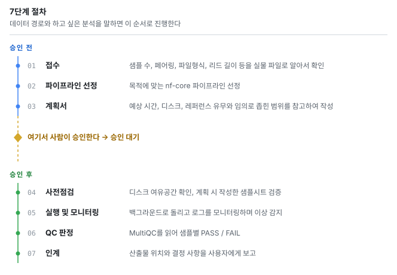
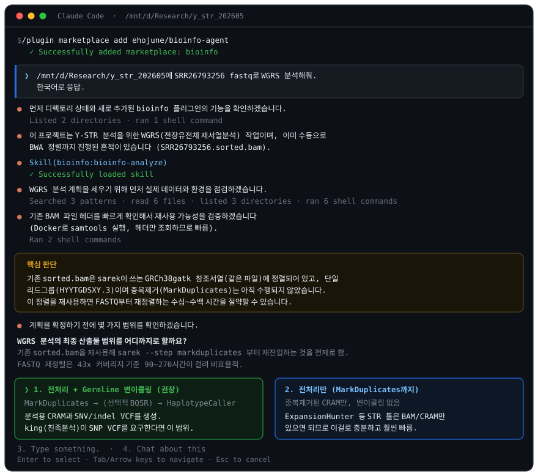

<p align="center">
  
</p>

<p align="center">
  
  
  
  
  <br>
  
  
  
</p>

<p align="center">
  <b>한국어</b> ·
  <a href="README.en.md">English</a>
</p>

<p align="center">
  <a href="#빠른-시작">빠른 시작</a> ·
  <a href="#실제-세션">실제 세션</a> ·
  <a href="#직접-설치">직접 설치</a> ·
  <a href="#사용법">사용법</a> ·
  <a href="#설계">설계</a> ·
  <a href="#지원-파이프라인">파이프라인</a>
</p>

---

**말로 시킨 bioinformatics 분석을 nf-core Nextflow 파이프라인으로 대신 돌려주는 Claude Code 기반
에이전트.**

데이터 경로와 하고 싶은 분석을 말하면 된다. 파이프라인을 고르고 샘플시트를 짜서, 예상 시간과
디스크를 계산한 계획서를 먼저 내놓는다. 승인이 떨어지면 실행하고 지켜보다가, MultiQC를 읽어 QC
판정까지 돌려준다. **개인 워크스테이션에서 돌고, 공용 서버나 HPC 클러스터에서도 돈다** — 달라지는
건 컨테이너 엔진과 executor 설정뿐이다.

**하지 않는 것**: 생물학적 해석. `NF1 gene isoform NF1-202의 발현 percentage는 18%` 까지가 이 에이전트의 일이고,
그게 연구에 무슨 의미인지는 사람의 일이다.

<p align="center">
  
</p>

---

## 빠른 시작

### 스킬만 먼저 써보기 — clone 불필요

```bash
claude plugin marketplace add ehojune/bioinfo-agent
claude plugin install bioinfo@bioinfo
```

끝이다. 데이터 경로와 하고 싶은 분석을 말하면 파이프라인 선정, 샘플시트, 소요 추정, 계획서까지
바로 나온다. `claude` CLI가 없으면 먼저 `curl -fsSL https://claude.ai/install.sh | bash`.

> **설치 경로는 둘 중 하나만.** 위의 `claude plugin` 과 Windows용 `install.ps1` 은 같은 일을 하는
> 두 방법이다. 둘 다 쓰면 스킬과 에이전트가 두 번 등록된다.

> **업데이트는 `claude plugin update bioinfo@bioinfo`.** 설치된 플러그인은
> `~/.claude/plugins/cache/bioinfo/bioinfo/<version>/` 처럼 **버전 이름 디렉터리**에 캐시된다.
> repo에 머지된 스킬 수정은 버전이 올라가야 이미 설치된 쪽에 도달한다 — 2026-08-10에 실제로
> 캐시된 0.1.0의 `runbook.md`가 repo보다 117줄 뒤처져 있었고, 그 상태로 실행 중이던 에이전트가
> 머지된 수정 이전의 절차를 그대로 따랐다. `scripts/check-plugin-version.sh` 가 이 드리프트를
> PR 단계에서 막는다.

### 실제로 파이프라인을 돌리려면

Nextflow, 컨테이너 엔진, 레퍼런스가 필요하다. **직접 세팅하지 말고 Claude Code에게 시키면 된다.**

```
https://github.com/ehojune/bioinfo-agent
이거 clone 하고 내 환경에서 쓸 수 있게 설정해줘.
```

Claude가 [docs/agent-setup.md](docs/agent-setup.md)를 따라 호스트 종류(개인 PC / 공용 서버 /
클러스터)를 판별하고 필요한 스크립트만 골라 돌린 뒤, 무엇이 준비됐고 무엇이 빠졌는지 보고한다.
손으로 하려면 [직접 설치](#직접-설치)로.

> 어느 쪽이든 **디스크가 필요하다.** 작업 공간 500GB 이상을 `$HOME` 이 아닌 큰 디스크에 잡는다.
> 사람 게놈 레퍼런스만 30GB대, 중간 산출물은 최종 결과의 몇 배로 부푼다.

---

## 실제 세션

<p align="center">
  
</p>

Y-STR 프로젝트에서 실제로 오간 세션이다. 눈여겨볼 곳은 **묻지 않은 것을 먼저 확인했다는 점**이다.
`fastq로 WGRS 분석해줘` 한 줄에서 출발했는데, 예전에 손으로 돌려둔 `sorted.bam` 의 헤더를 열어 정렬
기준까지 대조한 끝에 90~270시간짜리 재정렬을 건너뛰고 `--step markduplicates` 로 재진입하는 안이
나왔다. **그리고 거기서 멈추고 물어본다.**

---

## Nextflow와 nf-core

**[Nextflow](https://www.nextflow.io/)** ([문서](https://docs.seqera.io/nextflow/)) 는 각 단계를
컨테이너에서 돌리고 중간 결과를 캐시한다. 그래서 재현되고, `-resume` 으로 재개되고, 어디서든 돈다.
**[nf-core](https://nf-co.re/)** ([목록](https://nf-co.re/pipelines)) 는 그 위에서 규약을 통일한
커뮤니티 표준 파이프라인 150여 개다.

```bash
nextflow run nf-core/rnaseq -r 3.18.0 -profile docker --input samplesheet.csv --outdir results
```

이 한 줄이 QC → 트리밍 → 정렬 → 정량 → 리포트를 전부 처리한다. **이 에이전트는 그 한 줄을 대신
조립하고, 돌리고, 결과를 읽어준다.** 파이프라인 버전은 [`config/pipelines.tsv`](config/pipelines.tsv)
가 정하고, 실행 전에 대조한다. 위 예시처럼 문서에 적힌 리비전은 복사본이다.

---

## 직접 설치

빠른 시작으로 충분하면 건너뛴다. 요구사항은 Linux 또는 WSL2, Docker **또는**
Apptainer/Singularity, Java 17+, 그리고 `$HOME` 이 아닌 큰 디스크의 작업 공간 500GB 이상.

아래는 root가 있는 개인 워크스테이션 기준이다. **root 없는 공용 서버나 HPC 클러스터는
[docs/other-hosts.md](docs/other-hosts.md)** — Docker 대신 Apptainer, `$HOME` 밖 캐시, 스케줄러
설정, 낮춘 상한. 클러스터 헤드노드에서 `local` 로 돌리는 건 대부분 금지 사항이니 확인하고 시작한다.

### 1. 기반 구축

```bash
git clone https://github.com/ehojune/bioinfo-agent.git ~/bioinfo-agent
cd ~/bioinfo-agent
cp config/host.env.example config/host.env   # 배포판 이름, 경로, 자원 상한을 이 머신 값으로
set -a; . config/host.env; set +a

sudo -E bash bootstrap/01-wsl-base.sh   # Windows라면 00-windows-wsl.ps1 이 먼저
sudo -E bash bootstrap/02-docker.sh
bash bootstrap/03-nextflow.sh    # ~/.config/bioinfo/env.sh 를 쓴다. root로 돌리면 거부한다
bash bootstrap/06-tls-trust.sh   # 04보다 먼저. 레퍼런스를 받으려면 TLS가 살아 있어야 한다
bash bootstrap/04-refs.sh
bash bootstrap/05-verify.sh      # READY 를 찍기 전엔 설치가 끝난 게 아니다
```

전부 멱등이라 다시 돌려도 안전하다. **01·02는 root, 03·04·05·06은 파이프라인 사용자**로 돈다 —
01은 root가 아니면, 03은 root면 거부한다. 어느 스크립트를 누구로 돌리고 어느 호스트에서 무엇을
건너뛰는지는 [docs/agent-setup.md](docs/agent-setup.md) 의 표에 있다.

> **WSL 사용자 필독** — `.wslconfig` 를 반드시 설정한다(`config/wslconfig.example` 참고). 없으면
> WSL2가 호스트 RAM의 50%만 잡는데 사람 STAR 인덱스 빌드는 ~38GB를 요구한다. 경고 없이 OOM으로
> 죽고 `exit 137` 만 남는다. 값 뒤 인라인 주석을 못 받으니 주석은 별도 줄로.

### bootstrap이 가져가는 권한

`01-wsl-base.sh` 는 파이프라인 사용자에게 배포판 안에서 **암호 없는 sudo**를 준다
(`/etc/sudoers.d/90-bioinfo-nopasswd`). `02-docker.sh` 는 그 사용자를 **docker 그룹**에 넣는데,
데몬이 root로 도는 이상 docker 그룹은 실질적으로 root 권한이다. 무인 설치와 컨테이너 실행을 위한
것이고, 파이프라인 전용 WSL 배포판 안에서만 유효하다. 사람이 여럿 쓰는 머신이라면 01·02를 돌리지
말고 관리자에게 맡긴다.

### 2. 스킬·에이전트 등록

Claude Code의 스킬과 에이전트는 **로컬 파일**이라 Anthropic 계정을 따라다니지 않는다. [빠른
시작](#빠른-시작)의 `claude plugin` 두 줄이 설치의 전부고, `claude plugin details bioinfo@bioinfo`
로 확인한다. 리포를 직접 고칠 거라면 대신 `~/.claude/skills`, `~/.claude/agents` 에 심링크를 건다
(Windows는 심링크에 관리자 권한이 필요해 `install.ps1` 이 정션을 쓴다). **두 방식을 겹치지 말 것.**

---

## 사용법

스킬이 트리거로 자동 발동한다. 별도 명령이 없다.

```
~/data/rnaseq 에 FASTQ 8개 있어. 마우스 간조직, 대조군 4 처리군 4.
발현 차이 보고 싶어.
```

긴 실행은 에이전트에 위임한다 — `bioinfo-tech 에이전트한테 sarek 돌리라고 해줘`. `nextflow run`
은 로그를 수만 줄 뱉는데, 서브에이전트 안에서 돌면 그게 거기서 소화되고 결론만 돌아온다.

> **긴 실행은 반드시 `tmux`로 띄운다 — 창을 열어두는 것만으로는 부족하다.** WSL은 마지막 세션이
> 닫히면 배포판을 내려버려서 `nohup … &`로 띄운 작업이 로그 한 줄 없이 사라지고, 별개로 에이전트가
> 자기 안에서 백그라운드로 띄운 뒤 따로 기다리는 방식도 — 세션이 안 닫혀도 — 에이전트 턴이 끝나는
> 순간 죽는 게 이 저장소에서 실제로 두 번 확인됐다. `tmux` 서버 프로세스만 둘 다에서 살아남는다.
> 자세한 건 [runbook.md](skills/bioinfo-analyze/references/runbook.md) 5절.

주면 좋은 것: 데이터 절대경로, 샘플 수·형식, 종·게놈 빌드, **실제 질문**("희귀변이 찾기" 인지
"발현 차이" 인지에서 파이프라인이 갈린다), 설계, 시간 허용치, 기존 산출물. 경로만 줘도 시작한다 —
직접 세어보고 나머지를 추정한다. **요청이 모호하면 되묻고 멈춘다.**

---

## 설계

### 왜 시키지 않은 조사를 먼저 하는가

실제 분석 환경의 변수, 주로 human error를 통제하려는 것이다. **실행 환경**(Docker가 떠 있나,
디스크가 추정치의 1.5배 있나, 레퍼런스 경로가 풀리나)과 **입력 파일**(샘플 수, 페어링, 압축 여부,
리드 길이)을 설명이 아니라 실물에서 확인한다. "12샘플 paired-end"라고 들었는데 실제로는 9개인 일이
흔하고, 그건 12시간 뒤가 아니라 지금 알아야 한다.

그 일은 **에이전트 루프**가 맡는다. 자기 컨텍스트 창과 도구 권한이 따로 있는 인스턴스가 관찰 →
판단 → 실행을 반복한다. 단 **1~3단계는 읽기 전용**이라 `ls`, `du`, `file`, FASTQ 헤더 몇 줄까지다.
50GB BAM은 열지 않고 존재만 기록하며, 검증은 `plan.md` 항목이 된다.

3층 구조(기반·스킬·에이전트)를 나눈 이유, 레퍼런스 매니페스트, 가드레일 전체 목록은
**[docs/agent-architecture.md](docs/agent-architecture.md)** 에 있다. 처음 쓸 때 몰라도 되고,
나중에 확인해도 늦지 않다.

---

## 지원 파이프라인

문서화된 9개. 고정 리비전은 [`config/pipelines.tsv`](config/pipelines.tsv), 샘플시트 컬럼은
[samplesheets.md](skills/bioinfo-analyze/references/samplesheets.md), 자원 추정과 QC 기준과 실패
유형은 [`skills/bioinfo-analyze/references/`](skills/bioinfo-analyze/references/) 에 있다.

| 파이프라인 | 용도 | 주 산출물 |
|---|---|---|
| **rnaseq** | bulk RNA-seq 정량 | `salmon.merged.gene_counts.tsv` |
| **differentialabundance** | 발현 차이 (DESeq2) | HTML 리포트, DE 결과표 |
| **fetchngs** | 공개 데이터 수집 (`SRR`, `PRJNA`, `GSE`) | FASTQ + 다음 단계용 샘플시트 |
| **sarek** | germline / 체세포 변이 | VCF, 정렬 CRAM |
| **methylseq** | 메틸화 (WGBS/RRBS/EM-seq) | CpG 메틸화율, 전환율 |
| **atacseq** | 염색질 접근성 | consensus peak, bigWig |
| **chipseq** | ChIP-seq | peak, FRiP |
| **cutandrun** | CUT&RUN / CUT&Tag | peak (SEACR/MACS2) |
| **scrnaseq** | 단일세포 RNA | count matrix, h5ad |

나머지 nf-core 파이프라인도 요청하면 그때 조달한다. nf-core에 없는 ExpansionHunter, TRGT, HipSTR
같은 도구는 직접 돌리되 버전을 컨테이너로 고정하고 실행 기록에 남긴다. **커버하지 않는 것**:
롱리드(ONT, PacBio) 파이프라인, 그리고 생물학적 해석.

---

## 문제가 생기면

```bash
bash bootstrap/05-verify.sh
```

전 계층을 훑고 항목별 판정을 찍는다. 실행 중 실패는
[runbook.md](skills/bioinfo-analyze/references/runbook.md), 설치 중 실패는 — 신뢰 저장소 셋을 다
고쳐야 하는 사내망 TLS 검사를 포함해 — [docs/agent-setup.md](docs/agent-setup.md) 에 있다. 누구나
한 번은 밟는 셋: 중간에 죽었으면 `-resume` 이고 **work 디렉토리는 절대 지우지 않는다**. 스킬이 두
번 등록됐으면 플러그인과 `install.ps1`/심링크를 같이 쓴 것이다. 실행이 로그 한 줄 없이 사라졌으면
`nohup` 으로 띄운 것이다.

---

## 라이선스

[MIT](LICENSE)
