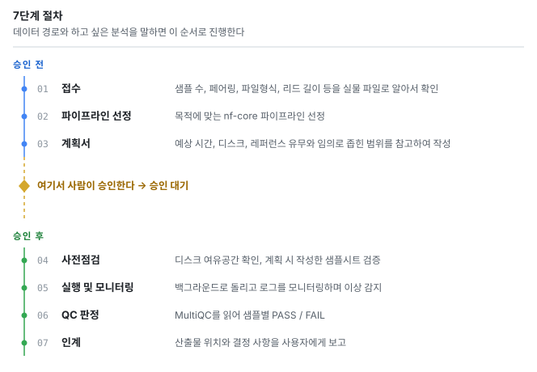

<p align="center">
  
</p>

<p align="center">
  
  
  
  
</p>

<p align="center"><b>한국어</b> · <a href="README.en.md">English</a></p>

**데이터 경로와 분석 목적을 말하면 Nextflow 파이프라인을 골라 실행하고 QC 결과를 보고하는 Claude Code 스킬·에이전트입니다.**

계획서에 입력, 기존 산출물 재사용, 필요한 시간과 디스크를 적고 승인을 기다립니다.
승인 후 사전점검과 실행을 거쳐 QC 판정·산출물·실행 기록을 인계합니다.
개인 PC, WSL2, 공용 서버, HPC에서 호스트에 맞는 컨테이너와 executor를 사용합니다.
생물학적 해석은 연구자가 맡습니다.

<p align="center">
  
</p>

## 빠른 시작

### 스킬과 에이전트 설치

```bash
claude plugin marketplace add ehojune/bioinfo-agent
claude plugin install bioinfo@bioinfo
claude plugin details bioinfo@bioinfo
```

파이프라인 선정과 계획서 작성은 clone 없이 시작합니다. 실제 실행에는 Nextflow, 컨테이너,
레퍼런스와 작업 공간이 필요합니다.

```bash
claude plugin update bioinfo@bioinfo
```

설치된 플러그인은 버전별로 캐시됩니다. 업데이트 안내와 근거는
[참고 자료](docs/reference/README.md)에 있습니다.
**플러그인과 `install.ps1`·심링크 설치 중 한 경로만 사용하세요.**

### 실행 환경 준비

Claude Code에 다음처럼 요청합니다.

```text
https://github.com/ehojune/bioinfo-agent
이 저장소를 clone하고 내 환경에서 파이프라인을 실행할 수 있게 설정해줘.
```

[설치 절차](docs/agent-setup.md)가 호스트 종류, 권한, 기존 레퍼런스를 확인하고 필요한
bootstrap을 고릅니다. 직접 설치하려면 Linux 또는 WSL2, Java 17+, Docker 또는
Apptainer/Singularity를 준비하고 `config/host.env.example`을 `config/host.env`로 복사해
경로와 자원 상한을 바꾸세요.

| 호스트 | 컨테이너와 실행 방식 | 설치 안내 |
|---|---|---|
| 개인 PC·전용 WSL | Docker, `local` | [bootstrap 순서와 실행 사용자](docs/agent-setup.md) |
| root 없는 공용 서버 | Apptainer/Singularity, 제한된 자원 | [다른 호스트 설정](docs/other-hosts.md) |
| HPC | Apptainer/Singularity, 사이트 스케줄러 | [다른 호스트 설정](docs/other-hosts.md) |

개인 PC의 기본 순서는 01 → 02 → 03 → **06(TLS) → 04(레퍼런스)** → 05입니다.
Windows라면 00이 먼저입니다. 01·02는 root, 나머지는 파이프라인 사용자로 실행하며 03은 root를 거부합니다.
01은 암호 없는 sudo를 설정하고 02는 root 권한에 준하는 Docker 그룹에 사용자를 넣으므로
공용 머신에서는 관리자가 설치를 맡습니다.

작업·캐시 경로를 홈 쿼터 밖에 잡고 계획서의 디스크·메모리 추정을 확인하세요.
STAR 작업은 ext4 등 Linux 파일시스템이 필요합니다. WSL의 `/mnt/c`, `/mnt/d` 같은 drvfs에서는
단순히 느린 데 그치지 않고 실행이 실패합니다. 사람 STAR 인덱스에는 약 38GB RAM이 필요하므로
[WSL 설정 예시](config/wslconfig.example)도 확인하세요.

```bash
bash bootstrap/05-verify.sh
```

판정을 읽고 호스트에 맞는 필수 항목이 준비됐는지 확인합니다. Apptainer 호스트에서 Docker 검사 실패를
다루는 방법도 설치 절차에 있습니다.

## 사용법

```text
~/data/rnaseq에 마우스 간조직 FASTQ가 있어. 대조군 4개, 처리군 4개야.
발현 차이를 보고 싶어.
```

데이터 경로, 종·게놈 빌드, 샘플과 실험 설계, 분석 목적, 시간 제한, 기존 결과를 알려주세요.
에이전트는 파일 수·형식과 필요한 헤더를 확인하고 재사용 가능한 산출물을 찾습니다.
계획 전 확인은 읽기 전용이며 요청이 모호하면 범위를 먼저 묻습니다.

긴 실행은 `bioinfo-tech 에이전트에게 sarek 실행을 맡겨줘`처럼 위임합니다.
**장시간 실행은 runbook의 tmux 절차를 사용합니다.** 에이전트 턴이나 WSL 세션이 끝나면서
백그라운드 작업이 사라진 사례가 있습니다.

| 알고 싶은 것 | 기준 문서 |
|---|---|
| 파이프라인 선정과 준비된 실행 범위 | [pipeline-selection.md](skills/bioinfo-analyze/references/pipeline-selection.md) |
| 입력 컬럼·페어링 | [samplesheets.md](skills/bioinfo-analyze/references/samplesheets.md) |
| 시간·디스크 추정 | [estimates.md](skills/bioinfo-analyze/references/estimates.md) |
| 실행·재개·실패 대응 | [runbook.md](skills/bioinfo-analyze/references/runbook.md) |
| QC 판정 | [qc-interpretation.md](skills/bioinfo-analyze/references/qc-interpretation.md) |

<p align="center">
  
</p>

## 지원 파이프라인

현재 목록은 **nf-core 19개와 저장소 내 PacBio 파이프라인 1개**입니다.
nf-core 고정 버전은 [config/pipelines.tsv](config/pipelines.tsv)가 정하며 사전점검에서 대조합니다.
아래 표는 이 저장소에서 준비한 실행 범위를 요약합니다. upstream의 모든 기능을 검증했다는 뜻은 아닙니다.

| 파이프라인 | 준비된 실행 범위 |
|---|---|
| rnaseq | bulk RNA-seq 정렬·정량 |
| differentialabundance | 발현 차이 분석·리포트 |
| fetchngs | 공개 accession에서 FASTQ·다음 단계 샘플시트 수집 |
| sarek | germline·somatic 변이 분석 |
| methylseq | 메틸화 분석 |
| atacseq | 염색질 접근성 |
| chipseq | ChIP-seq peak·QC |
| cutandrun | CUT&RUN·CUT&Tag |
| scrnaseq | 단일세포 RNA count matrix |
| ampliseq | 16S/ITS amplicon, DADA2·QIIME2 |
| mag | shotgun metagenome assembly·binning·QC |
| taxprofiler | Kraken2 기반 분류군 profiling |
| nanoseq | basecall 완료된 ONT DNA FASTQ의 QC·정렬 |
| rnasplice | SUPPA2 per-isoform splicing 분석 |
| raredisease | 변이 호출·QC; 전체 annotation·질환 순위화는 준비 범위 밖 |
| bacass | short-read bacterial assembly·Prokka annotation |
| viralrecon | Illumina SARS-CoV-2 amplicon, 변이·consensus·lineage 결과 |
| isoseq | PacBio subreads에서 Iso-Seq transcript model 생성 |
| spatialaxe | 10x Xenium bundle의 coordinate mode segmentation·QC |

**[pacbio-hifi-wgs](pipelines/pacbio-hifi-wgs/)**는 저장소 안의 Nextflow DSL2 파이프라인입니다.
subreads, HiFi BAM/FASTQ, 정렬 BAM에서 시작하며 germline SNV/indel, pbsv SV, 위상·haplotag·QC를 처리합니다.
정렬된 tumor–normal BAM 쌍은 CPU DeepSomatic으로 분석합니다. `--run_label`로 공유 outdir의 리포트를 구분합니다.

CLR 입력도 받지만 HiFi로 변환되지 않습니다. CLR의 small-variant caller에는 맞는 모델이 없어
그 결과는 탐색용이며 데이터셋마다 경고 파일을 남깁니다. 정확도 근거와 입력별 제한은 파이프라인 README를 보세요.

추가 파이프라인은 [조달 절차](skills/bioinfo-analyze/references/new-pipeline.md)에 따라 요청 때 검토합니다.
nf-core 재사용, 직접 도구 실행, 저장소 내 파이프라인 구축 등 선택지를 계획서에 제시하고 승인을 받습니다.

## 실행 근거

[예제 기록](docs/examples/README.md)과 [근거 색인](docs/reference/README.md)에서 실제 실행과 알려진 제한을 확인합니다.
test profile 통과, 실데이터 완주, truth set 기반 정확도는 서로 다른 검증 단계입니다.

PacBio [전장유전체 기록](docs/examples/20260926-pacbio-hifi-wgs-giab-wholegenome/handoff.md)은
GIAB small variants 19회, HG002 SV 5회, HG008 somatic 쌍 13회의 비교를 담습니다.
germline 수치는 과거 `48ec463`에서 측정했으며 현재 0.2.0을 같은 데이터로 재실행한 결과가 아닙니다.
SV는 HG002만 검증됐고 somatic INDEL recall은 낮습니다. 전체 조건과 수치는 해당 기록에 있습니다.

## 문제가 생기면

설치는 `bootstrap/05-verify.sh`와 [설치 절차](docs/agent-setup.md), 실행은 다음 명령부터 확인하세요.

```bash
bash "$BIOINFO_HOME/scripts/triage-run.sh" --tail 20 "$NXFDIR"
bash "$BIOINFO_HOME/scripts/triage-run.sh" --json "$NXFDIR"
```

읽기 전용으로 로그·trace·실패 작업의 명령과 stderr를 보고합니다.
상태는 `running`, `failed`, `cancelled`, `succeeded`, `unknown`이며 실패한 시도만으로
전체 실행을 실패라고 판단하지 않습니다.

재개는 `-resume`을 사용하고 work 디렉터리와 실행 기록을 보존하세요.
개인 `runs/` 기록은 Git에서 제외되며 공유 예제는 `docs/examples/`에 있습니다.
작업 디렉터리 가드는 설치된 플러그인의 Bash 도구 호출에 적용됩니다.

구조·레퍼런스 계약·가드레일은 [설계 문서](docs/agent-architecture.md)에서 확인하세요.

## 라이선스

[MIT](LICENSE)
